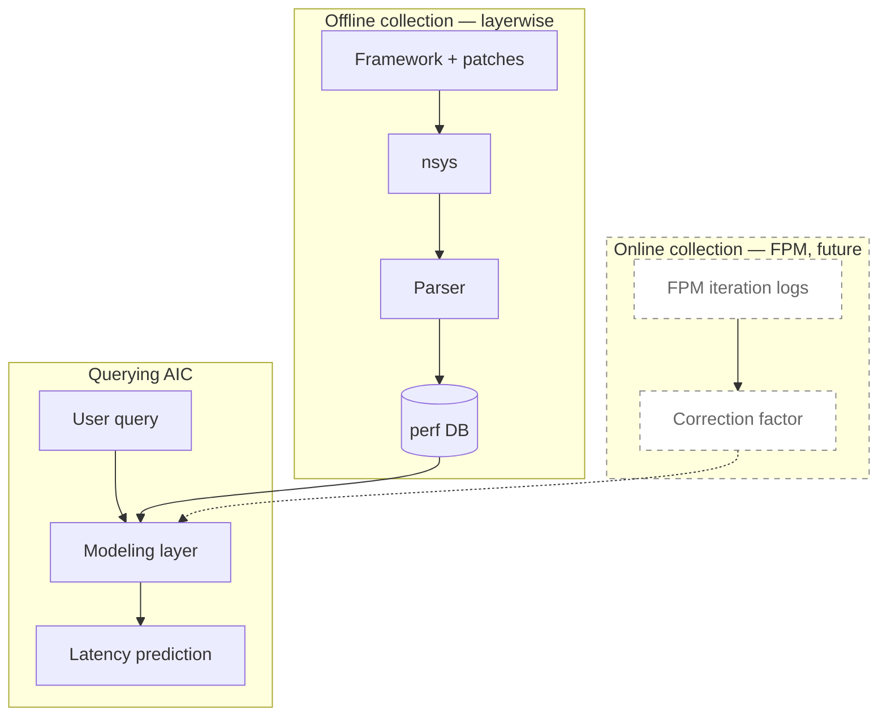
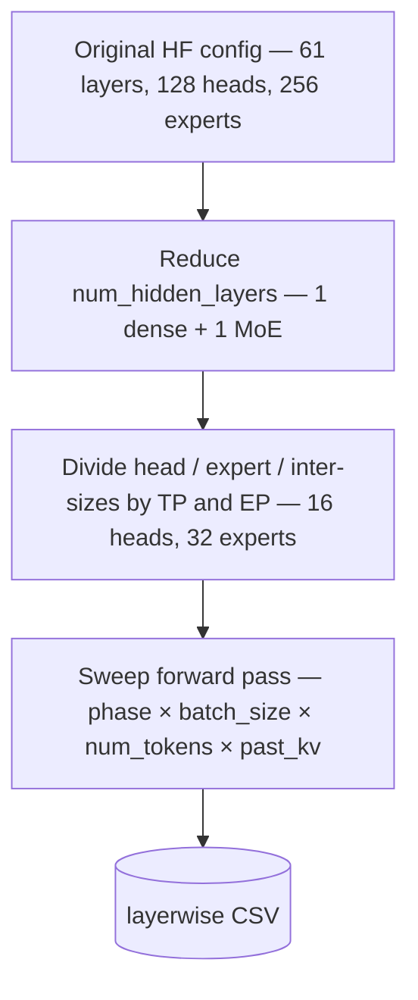
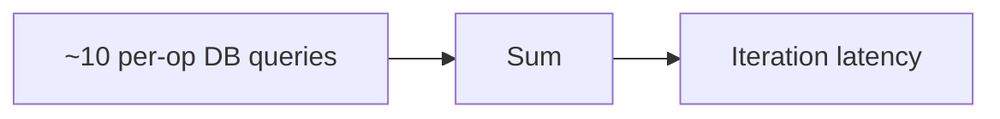
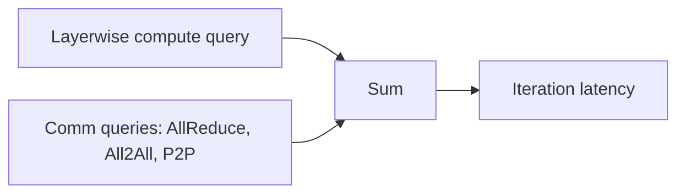

# AIC Layerwise Migration — Design Doc

## 1. Overview

This document proposes migrating AIC's compute data collection from per-op microbenchmarks to layerwise — whole-decoder-layer wall time measured inside the real framework engine via NVTX-instrumented nsys traces on a single GPU. The primary driver is maintainability: op-level today scales poorly across new models, framework versions, and GPU systems.

Highlights:

- Collection moves from per-op to layerwise: one row per `(framework × version × system × model × parallelism × preset × phase × batch_size × num_tokens × past_kv)`. The compute side of `aiconfigurator/sdk/models/<family>.py` shrinks from hundreds of lines of shape math to a tiny declaration. Per-cell collection drops from ~30-hour serial sweeps to 2–3 min units that parallelize trivially across GPUs.
- Accuracy goal: <5% MAPE vs FPM-measured iteration latency in AIC's main operating range (large models, CUDA-graph decode, `bs ∈ [1, 256]`, `past_kv ∈ [128, 16k]`). Validated during PoC.
- In scope: layerwise compute on a single-GPU mock. Inter-rank comm (NCCL / AllReduce / All2All / P2P) continues using AIC's existing `collect_comm.sh` infrastructure unchanged. Op-level remains as a fallback during the rollout.
- FPM calibration is deferred to future work — per-iteration telemetry from real deployments as a learned correction on top of layerwise. Replaces hand-tuned constants (e.g. `_RATE_MATCHING_PREFILL_DEGRADATION_FACTOR = 0.9`) with per-`(framework, system)` scales fit from real data.
- Rollout: vLLM first (PoC on Qwen3-32B → DeepSeek-V4 → full ~30-model production), then SGLang and TRT-LLM in parallel, then FPM. For vLLM, MoE stays on op-level data — the dummy-weight routing collapse fix is outside this rollout's scope.

---

## 2. Background: Why change from op-level

Op-level collection has become a huge cost in AIC's development cycle. Onboarding a new model frequently requires adding new op collectors for the 3 frameworks (TensorRT-LLM, SGLang, vLLM) and adding new collection data points to existing collectors. Collectors need lots of fixes whenever we upgrade the framework versions. The op-level collector code is very brittle because of its reliance on low-level functions in the framework rather than high-level APIs which are stable across versions. Each combination of `(system x framework version x op)` has its own bugs. As the list of AIC-supported systems and models (and ops) grows, supporting the op-level collector is becoming very time consuming, and AIC is frequently weeks or months behind the latest framework releases.

---

## 3. Goals and non-goals

### Goals

1. Maintainability and scalability. Onboarding a new model, GPU SM, system, or framework version should require bounded, well-scoped engineering work. Model-specific and system-specific branching should be avoided wherever possible.
2. Accuracy: <5% MAPE in AIC's operating range. The collector rewrite is useless if AIC can't use it to accurately model TTFT and TPOT.
3. FPM-compatible architecture. Even though FPM-based calibration is deferred, the modeling layer must be structured so that an FPM correction layer can plug in without a second migration. This is the main forward-looking design constraint.

### Non-goals

1. Universal model / system coverage on day 1. Initial rollout targets a small set of model families and systems sufficient to validate the approach and demonstrate the MAPE goal. Coverage expansion is incremental and gated on the per-model onboarding flow being cheap (Goal 1).
2. Anything outside modeling the engine forward pass. Scheduling, etc., will be handled by Mocker.

---

## 4. Proposed design: layerwise as the primary collector

### 4.1 Architecture overview

The layerwise pipeline has two offline halves — collection and AIC consumption — connected by a flat CSV. FPM-based calibration bolts onto the modeling layer at one well-defined point; the baseline architecture stays the same with or without it.

Collection drives the framework's engine in-process through its offline benchmark entrypoint (`vllm.benchmarks.latency`, `sglang.bench_one_batch`, or TRT-LLM's `examples/layer_wise_benchmarks/run.py`) — not through `vllm serve` / `sglang.launch_server` / `trtllm-serve`. This lets us set the workload shape (`batch_size`, `num_tokens`, `past_kv`) directly instead of going through the request-scheduling path. The HF config is patched to (i) reduce the model to the minimal layer set sufficient for the target layer types (one dense + one MoE layer for hybrid models) and (ii) mock parallelism on a single GPU by post-sharding head/expert counts and inter-sizes to per-rank values. nsys captures the run, and a parser attributes each CUDA kernel to a `(model, parallelism, layer-type, phase, batch_size, num_tokens, past_kv)` bucket via a 2-step JOIN through `originalGraphNodeId` — needed because under cuda-graph mode the standard `correlationId → NVTX` path doesn't reach individual replay kernels. Output is a flat CSV.

Per-`nn.Module` attribution requires NVTX hooks on every module's `forward()`. vLLM and SGLang ship these built-in (`--enable-layerwise-nvtx-tracing` / `--enable-layerwise-nvtx-marker`); TRT-LLM's upstream layerwise bench emits only a single outer event per run today, so adding equivalent NVTX coverage to the TRT-LLM path is one of the gaps to close in the migration. Non-target DecoderLayers are short-circuited via different mechanisms per framework: a runtime identity-forward monkey-patch for vLLM and SGLang; config-level `num_hidden_layers` reduction plus the built-in `--layer-indices` flag for TRT-LLM. Current per-framework prototype state — including known caveats (FlashMLA head padding, DSV4 cache patch, dummy-weight MoE routing collapse) — is in Appendix A.

AIC consumption loads the CSV into a perf database keyed by `(model, parallelism, layer-type)` and queries by `(batch_size, num_tokens, past_kv)` with interpolation over the sweep grid. The modeling layer composes the prediction as `num_layers × layer_time + non_layer_ops`. AIC's downstream search and Pareto layers consume the prediction unchanged.

The FPM future hook plugs in as a multiplicative correction at the modeling layer, learned per `(model × system × framework version × shape regime)` from real-deployment iteration logs. The structural prediction stays layerwise; FPM closes the sim-vs-real residual.

Diagram 1 — System architecture




Three phases: offline collection (layerwise data → perf DB), online collection (real-deployment iteration logs → correction factor — future), and querying AIC (user query → modeling layer → prediction). The modeling layer reads from the perf DB and, when FPM data is available, applies the correction factor.

### 4.2 Collection mechanics

#### Prefill eager, decode cuda-graph

All three frameworks run benchmarks under the same rule — prefill eager, decode cuda-graph — matching production execution. Each framework exposes this via its own switch; see Appendix A.

#### HF config manipulation: from real model to single-GPU TP-mock

Each collection run takes a real HF model config and progressively transforms it into a single-GPU equivalent of one rank of a target parallelism config. The same HF config manipulation logic can be shared by all frameworks. Three transformation steps, then a forward-pass sweep:

Diagram 2 — Config transformation pipeline (example: DeepSeek-V3, target TP=8 EP=8 moe_tp=1)




Step A — Reduce num_hidden_layers. Some transformer architectures have only one type of transformer block (e.g. Llama), while others have multiple (e.g. DSV3 has 3 dense blocks and 58 MoE blocks). The HF config is manipulated to preserve 1 type of block. This greatly reduces how long the collection takes.

Step B — Divide head / expert / inter-sizes for parallelism mock. For target `(attn_tp, moe_tp, ep)` with constraint `attn_tp = moe_tp × ep`, the patcher divides `num_attention_heads`, `num_key_value_heads` (ceil), and `intermediate_size` by `attn_tp`; divides `n_routed_experts` / `num_experts` by `ep`; and divides `moe_intermediate_size` by `moe_tp`. The framework loads what appears to be a smaller model matching one rank's worth of compute, runs on a single GPU, and produces per-rank kernel times. Inter-rank comm is excluded by design and collected separately.

Step B variant — WideEP MoE. WideEP couples attention-DP with MoE-EP (`dp_size = ep_size`) and each EP rank computes only the tokens routed to its local experts after an all2all dispatch. Mocking it differs from plain EP in three ways, all of which match the reference simulator at `aiconfigurator/collector/trtllm/collect_wideep_moe_compute.py:WideEPMoEComputeSimulator` (used with `AIC_ACCURATE_WIDEEP_SIM=1`; equivalent in `aiconfigurator/collector/sglang/collect_wideep_deepep_moe.py`):

1. `num_slots` can exceed `num_experts`. EPLB replicates hot experts across redundant slots (e.g. 256 experts → 288 slots). The local expert count per rank becomes `num_slots / ep_size`, not `num_experts / ep_size`; the patcher must divide by the EPLB-adjusted slot count when applicable.
2. Token count is per-DP-rank. Real per-iteration tokens reaching one rank's MoE compute = `num_tokens / dp_size` (with `dp_size = ep_size`). The sweep should pass this already-divided count.
3. All2all dispatch / combine is excluded from MoE compute timing. Layerwise captures only the rank0-local MoE work; cross-rank all2all is a comm op collected separately. The reference simulator enforces this by running router-only on the full DP slice, then MoE-only on the rank0-filtered tokens.

The layerwise migration needs to apply this WideEP-aware mocking when the target parallelism is a WideEP config.

Step C — Sweep forward pass. For each shape in the sweep matrix, the framework runs the patched model under the canonical execution rule; nsys captures the run; the parser emits one CSV row per `(layer-type, bs, shape)` per `(model, parallelism)`. The two phases sweep independently, but both use the same conceptual shape axes: `num_tokens` and `past_kv`.

- Context (prefill) — workload is `(num_tokens, past_kv)`, with `batch_size = 1`. `num_tokens` is the prefill chunk length. The default vLLM grid is `num_tokens ∈ {1, 2, 4, …, 8192}` × `past_kv ∈ {0, 1, 2, 4, …, 65536}`, filtered by the model's max length. Sweeping `past_kv` matters because chunked prefill produces context iterations with non-zero `past_kv`; modelling only `past_kv = 0` would miss those. Run eager instead of cuda-graph.
- Generation (decode) — workload is `(num_tokens, past_kv)`, where `num_tokens` is the number of one-token decode requests in the iteration. In the current vLLM collector this is stored as `batch_size = num_tokens` and `new_tokens = 1`. The default vLLM grid is `num_tokens ∈ {1, 2, 4, …, 1024}` × `past_kv ∈ {1, 2, 4, …, 8192}`, subject to a product budget so the run fits in GPU memory. Run under cuda-graph.

Per-framework entrypoint specifics — e.g. vLLM's target-iteration capture under one bench run vs TRT-LLM's separate `config_ctx.yaml` / `config_gen.yaml` invocations — are in Appendix A.

#### Caveats currently in the prototype

Three fidelity gaps documented in this repo, all surfaced again in Appendix A:

- FlashMLA single-GPU TP mock. FlashMLA only dispatches `h_q ∈ {64, 128}`. For TP-mocked MLA models with `h_q < 64`, the prototype pads heads to 64 and slices output back (`LAYERWISE_FLASHMLA_PAD_HQ=1` in `sglang_model_patches.install_flashmla_pad_patch`). Inflates MLA attention time relative to a real TP rank.
- DSV4 cache patch. `sglang_model_patches.install_deepseekv4_cache_patch` works around a `DeepSeekV4TokenToKVPool` shape issue; one-off, model-specific.
- MoE under dummy weights. Dummy gate output collapses routing to few experts → ~10× MoE under-estimate. Mitigated for SGLang via `sglang/moe_topk_hack_patch.py` (power-law routing borrowed from `aiconfigurator/collector/helper.py`). Equivalent patches for vLLM and TRT-LLM are open work (aic-layerwise README TODO #2).

### 4.3 Parameter sweep matrix

As with the op-level collector, collection jobs run for a specific combination of `(framework, framework_version, system)`. Within a collection job, the layerwise collector sweeps over the following:


| Axis                                | Range                                                                                                                     | Notes                                                                                                                                                                                        |
| ----------------------------------- | ------------------------------------------------------------------------------------------------------------------------- | -------------------------------------------------------------------------------------------------------------------------------------------------------------------------------------------- |
| Model                               | list of HF model IDs. e.g. `qwen/qwen3-32b, deepseek-ai/deepseek-r1, nvidia/deepseek-r1-nvfp4`                            | List of models can be filtered, for example when needing to collect data for only newly-supported models.                                                                                    |
| Parallelism `(attn_tp, moe_tp, ep)` | dense: `tp ∈ {1, 2, 4, 8}`. MoE: combinations satisfying `attn_tp = moe_tp × ep`. WideEP restricted to large models only. | Single-GPU mock per Step B above. Bounded by what the model actually supports (e.g. `num_heads` divisible by `attn_tp`).                                                                     |
| Layer type                          | `{dense, moe}` for hybrid models; `{dense}` for pure dense                                                                | Used internally during collection — both layer types are timed in the same nsys trace, then aggregated into the single `latency_ms` column during post-processing. Not a CSV key.            |
| Phase                               | `{ctx, gen}`                                                                                                              | Run separately under the prefill-eager / decode-cuda-graph rule.                                                                                                                             |
| Quant preset                        | per-model subset of 7 presets (table below)                                                                               | Each preset → a `(gemm, moe, attn, kv)` quant tuple. Scope per model bounded by native model+framework support.                                                                              |
| ctx: `batch_size × new_tokens × past_kv` | `bs = 1`, `new_tokens ∈ [1...16k]`, `past_kv ∈ [1...64k]`                                                            | 2D sweep so chunked-prefill iterations (non-zero past_kv during ctx) are captured.                                                                                                          |
| gen: `batch_size × past_kv`              | `bs ∈ [1...1024]` × `past_kv ∈ [1...64k]`, `new_tokens = 1` implicit                                                  |                                                                                                                                                                                              |


Quant presets (referenced by the axis above):


| Preset       | GEMM             | MoE       | Attn | KV   |
| ------------ | ---------------- | --------- | ---- | ---- |
| `bf16`       | bf16             | bf16      | bf16 | bf16 |
| `fp8`        | fp8 (per-tensor) | fp8       | bf16 | bf16 |
| `fp8_kv`     | fp8              | fp8       | bf16 | fp8  |
| `fp8_full`   | fp8              | fp8       | fp8  | fp8  |
| `fp8_block`  | fp8_block        | fp8_block | bf16 | bf16 |
| `nvfp4`      | nvfp4            | nvfp4     | bf16 | fp8  |
| `nvfp4_full` | nvfp4            | nvfp4     | fp8  | fp8  |


Per-model scope examples (full mapping in Appendix B):

- BF16-base models (Llama-3-70B base, Qwen3-32B base): `{bf16, fp8, fp8_kv, fp8_full}` (FP8 via runtime quant)
- Per-tensor FP8 native (Qwen3-32B-FP8, GLM-5-FP8): `{fp8, fp8_kv, fp8_full}`
- Per-block FP8 native (DeepSeek-V3 family): `{fp8_block}`
- NVFP4 native, Blackwell (Nemotron-3-Super-NVFP4, Kimi-K2.5-NVFP4): `{nvfp4, nvfp4_full}`

One collection produces approximately `|parallelism| × |presets| × (|new_tokens_ctx| × |past_kv_ctx| + |bs_gen| × |past_kv_gen|)` rows. Worked examples assume 4 parallelism configs, 14 new_tokens × 8 past_kv values for the ctx sweep (112 ctx shapes), 11 bs × 14 past_kv values for the gen sweep (154 gen shapes), so 266 shapes per parallelism × preset cell:

- BF16-base MoE model (4 presets): `4 × 4 × 266` ≈ 4,300 rows
- Per-tensor FP8 native MoE (3 presets): `4 × 3 × 266` ≈ 3,200 rows
- DSV3-family (1 preset): `4 × 1 × 266` ≈ 1,100 rows

Across AIC's current support coverage (~30 models × ~3 frameworks × ~6 systems × a few versions per framework), expect on the order of 10⁵–10⁶ total rows in the layerwise perf DB.

### 4.4 Data schema

The exact output schema isn't critical — any format that captures the output data could work. A reasonable starting proposal:

CSV file called `layerwise_perf.txt` similar to the existing AIC `*_perf.txt` files.

```csv
framework,framework_version,system,model,attn_tp,moe_tp,ep,num_slots,gemm_quant,moe_quant,attn_quant,kv_quant,phase,batch_size,new_tokens,past_kv,latency_ms
TRT-LLM,1.2.0rc5,h200_sxm,deepseek-ai/DeepSeek-V3,8,1,8,256,fp8_block,fp8_block,bf16,bf16,ctx,1,4096,1,3247.2
TRT-LLM,1.2.0rc5,h200_sxm,deepseek-ai/DeepSeek-V3,8,1,8,256,fp8_block,fp8_block,bf16,bf16,ctx,1,2048,8192,2841.0
TRT-LLM,1.2.0rc5,h200_sxm,deepseek-ai/DeepSeek-V3,8,1,8,256,fp8_block,fp8_block,bf16,bf16,gen,32,1,4096,98.4
```

Notes on the proposal:

- `new_tokens` is the number of input tokens being processed this iteration; `past_kv` is the length of the KV cache already populated. For `phase=ctx`, both vary (chunked prefill); for `phase=gen`, `new_tokens = 1` is implicit and `past_kv` varies.
- `batch_size` is always 1 for `phase=ctx`.
- `latency_ms` is the total predicted forward-pass latency for one iteration. It is pre-aggregated during post-processing as `num_dense × dense_block + num_moe × moe_block + embedding + lm_head + final_norm + sampler`, where the per-block / non-layer times come from the same nsys trace and the layer counts are read from the unpatched HF config.
- `num_slots = num_experts` for regular EP; exceeds it under WideEP+EPLB (e.g. 288 for DSV3).
- `gemm_quant`, `moe_quant`, `attn_quant`, `kv_quant` record the per-op quant actually used. The CSV is the source of truth; the "preset" names from the sweep matrix are a collection-control convenience and are not stored. AIC queries can filter on any per-op quant directly.

Alternative schema considered: emit separate columns for `dense_block_latency_ms`, `moe_block_latency_ms`, `embedding_latency_ms`, `lm_head_latency_ms`, and `non_layer_other_ms` (5 latency columns instead of 1). Pros: enables per-rank attribution for PP > 1 (embedding on rank 0, lm_head on the last rank), and supports diagnostic breakdowns ("how much of the iteration is MoE vs attention?"). Cons: wider schema, more shape-math in the modeling layer for the aggregation. Chose the single-column form because AIC's current PP modeling already approximates with a single-rank-full-model latency + P2P comm overhead (rather than true per-rank computation).

A 6th column, `attention_latency_ms`, may be added later if mixed-step (chunked prefill) MAPE exceeds the 5% goal — see the mixed-step subsection for why. Implementation note: attention kernel time should be isolated via a custom NVTX range pushed around the attention kernel call in each framework's attention backend (~one small framework-side patch per framework: vLLM, SGLang, TRT-LLM), not via kernel-name regex matching against CUPTI `shortName`. The NVTX-range approach has lower long-term maintenance: each new attention kernel implementation (FlashAttention 4, new FlashMLA variant, etc.) doesn't require updating an allowlist — the range still fires regardless of which kernel runs inside. Framework refactors of the attention call site happen less often than new kernels ship.

### 4.5 Data volume and collection runtime

First-order estimates to size the rollout. Concrete numbers land during PoC.

Per-invocation runtime (one parallelism × one quant preset × ctx + gen sweep, single GPU, dummy weights, reduced `num_hidden_layers`): ~2 minutes.

Per `(model × framework × version × system)` cell: ~10 parallelism × ~4 presets ≈ 40 invocations → ~1 hour. With 8 GPUs per node, this is reduced to ~10 minutes.

Per `(framework × version × system)` CI job: for ~30 models with ~10 minutes per model, the runtime is about ~5 hours. This is roughly the same as the current AIC collector. However, this number is very sensitive to our assumptions and can explode if we add more variables. It will be important to reduce overheads during the data collection script as much as possible, for example by reducing the number of trtllm imports, using autotune caches, etc.

Incremental costs (after baseline coverage is built):


| Trigger               | Cells needed                                | Approx time                        |
| --------------------- | ------------------------------------------- | ---------------------------------- |
| New model added       | 1 model × 3 framworks × 7 systems           | 21 parallel CI jobs, each ~10 mins |
| New framework version | 30 models × 1 framework version × 7 systems | 7 parallel CI jobs, each ~5 hours  |
| New GPU system        | 30 models × 3 frameworks × 1 system         | 3 parallel CI jobs, each ~5 hours  |


### 4.6 AIC modeling layer changes

The modeling layer collapses to a single layerwise DB query per `(parallelism, preset, phase, bs, new_tokens, past_kv)`, scaled by per-layer-type counts, plus a short tail of non-layer ops. The optimization / search / Pareto layer is untouched. Code-level specifics live in Appendix C; this section stays high-level.

Diagram 3 — Data flow before and after

Before (op-level, current):




After (layerwise):




The compute aggregation (`num_dense × dense_block + num_moe × moe_block + embedding + lm_head + …`) lives in the collection / post-processing path, not the modeling layer. Comm queries reuse AIC's existing infra unchanged — see the inter-rank communication subsection below.

What `aiconfigurator/sdk/models/<family>.py` becomes. Today each model class hand-encodes a `context_ops` and `generation_ops` list — hundreds of lines of shape math per family (see `deepseek_v4.py` for the worst case). Under layerwise the per-model code shrinks substantially but doesn't disappear, because comm modeling still needs model-level shape inputs:

- Supported quant presets — which subset of `{bf16, fp8, fp8_kv, fp8_full, fp8_block, nvfp4, nvfp4_full}` this model can be collected at.
- Comm pattern: which inter-rank ops fire and where. For most decoder-only LLMs this is just "standard TP + EP" — AllReduce after attention `out_proj` and after FFN/MoE down_proj; All2All dispatch/combine around MoE; P2P between PP stages. WideEP and Attention-DP also get their own handling. Models with non-standard comm can have custom handling.
- Architecture knobs needed for comm sizing — `hidden_size`, `num_experts`, `topk`, etc. Read from HF config and threaded into the existing `query_nccl` / `query_custom_allreduce` / `query_p2p` calls (the same ones op-level uses today).

Interpolation strategy: reuse the existing interpolation logic from AIC. First, find data points with matching `(model, framework, version, system, parallelism, quantization, phase)`. Then, find nearest neighbors of `(batch_size, new_tokens, past_kv)` and interpolate.

Mixed-step latency. Real serving steps can be pure ctx, pure gen, or mixed — both new ctx tokens and decode tokens in the same forward pass. Op-level today handles this with a 3-pass decomposition in `aiconfigurator/src/aiconfigurator/sdk/backends/trtllm_backend.py:140-289` (`_get_mix_step_latency`):

- Non-attention ops queried once at the merged batch (`isl = ctx_tokens + gen_tokens`)
- `context_attention` queried at the real ISL and scaled by `1 / ceil(isl/ctx_tokens)`
- `generation_attention` queried at `(batch = gen_tokens, past_kv = isl + osl/2)`
- Sum the three components

This works because op-level queries `context_attention` and `generation_attention` as their own ops, separately from the non-attention GEMMs.

Initial layerwise approach. Our day-1 single `latency_ms` column doesn't break attention out, so the 3-pass decomposition isn't directly usable. The initial formula mirrors AIC's existing layerwise codepath at `trtllm_backend.py:169-192` (the `_USE_LAYERWISE` branch), which treats all tokens as a single CTX batch:

`mixed_step_latency ≈ ctx_latency(new_tokens = ctx_tokens + gen_tokens, past_kv = average_past_kv)`

One CSV row lookup, no decomposition. Good approximation when ctx_tokens dominate the step (chunked prefill is the common case where mixed steps matter). Degrades when many decode requests with large `past_kv` are mixed in, because the merged-batch CTX query ignores the gen-attention cost on the existing KV cache.

Refined approach (later). If the initial approximation's MAPE exceeds the 5% goal, add an `attention_latency_ms` column to the CSV (isolated via a custom NVTX range around the attention kernel) and adopt the same 3-pass decomposition op-level uses today, now driven by layerwise data:

- `non_attn_merged = latency_ms(C+D) − attention_latency_ms(C+D)` — non-attention ops at the merged CTX batch
- `attn_ctx = attention_latency_ms` from the CTX row at `new_tokens = C` — real ctx-attention shape
- `attn_gen = attention_latency_ms` from the GEN row at `(batch=D, new_tokens=1, past_kv=K)` — real gen-attention with KV cache
- `mixed_step_latency = non_attn_merged + attn_ctx + attn_gen`

Structurally identical to op-level's 3-pass (non-attention at merged batch + ctx-attention + gen-attention), just sourcing each component from the layerwise CSV instead of per-op queries.

Either way, FPM remains the natural calibration source — the iteration-log row directly captures real mixed-step wall time.

Inter-rank communication. Layerwise collection runs on a single-GPU mock and excludes inter-rank comm by design — `AllReduce` (TP), `All2All` (EP), and `P2P` (PP) don't fire. The migration reuses AIC's existing comm infrastructure unchanged:

- Collection: `aiconfigurator/collector/collect_comm.sh` (NCCL ops) and `collect_all_reduce.py` (TRT-LLM CustomAllReduce), producing `comm_perf.txt` and `custom_all_reduce.txt`.
- Query path: `query_nccl`, `query_custom_allreduce`, `query_p2p` in `perf_database.py`.

The modeling layer adds comm separately at query time, same as it does today for op-level — AllReduce after attention `out_proj` and after FFN/MoE under `tp > 1`, All2All dispatch/combine under `ep > 1`, P2P between stages under `pp > 1`. Comm collectors aren't part of the maintainability problem (NCCL / AllReduce APIs are stable across versions), so no changes to them are needed for this migration.

Known limitation: compute/comm overlap. Frameworks increasingly overlap AllReduce with the next GEMM and All2All with expert compute. Neither op-level nor layerwise captures this — they measure isolated kernel times that AIC sums serially. The simulator is therefore pessimistic relative to real iteration latency. FPM calibrates this.

### 4.7 Onboarding a new model

The side-by-side below shows what each step requires under the two approaches.


| Onboarding step                | Op-level (today)                                                                                                                                             | Layerwise (proposed)                                                              |
| ------------------------------ | ------------------------------------------------------------------------------------------------------------------------------------------------------------ | --------------------------------------------------------------------------------- |
| HF config mapping              | Same                                                                                                                                                         | Same                                                                              |
| Model SDK class                | ~hundreds of lines of shape math (`context_ops` / `generation_ops`, per-op shapes, per-layer scale factors) — see `aiconfigurator/sdk/models/deepseek_v4.py` | ~10–20 lines: supported quant presets, comm pattern, comm-sizing knobs            |
| New op support (MLA, MHC, DSA) | New per-op collector files in each of 3 frameworks + new `perf_database.query_*` method + new `Operation` subclass + extend `common_test_cases.py`          | Usually nothing — the layerwise nsys trace captures whatever kernel actually runs |
| Per-op test cases              | Extend `common_test_cases.py` with the model's shape needs across affected ops                                                                               | None — the sweep matrix is model-agnostic                                         |
| Framework or collector patches | n/a                                                                                                                                                          | Some patches may be needed in the layerwise collectors to support the new model   |
| Collection                     | Collect data for new ops                                                                                                                                     | Collect data for new models                                                       |


Adding a new model under layerwise is mostly declarative — a small SDK class with quant presets and comm calculations, a couple of one-line entries in the layer-skip / config-patch tables if new.

Where layerwise may still need real work:

- Models with non-standard `config.json` fields that don't map cleanly to `parallel_config_patch.py` (e.g., DSV4's MHC, exotic MoE shapes)
- Models with framework-version-specific load issues
- New attention backends where single-GPU TP-mock fidelity is uncertain

These are real but bounded — each is a one-off small patch rather than the recurring per-framework-version, per-system grind op-level requires.

---

## 5. Sources of prediction error and mitigations

This section enumerates known sources of gap between AIC's simulated iteration latency and real wall time, sorted by which approach addresses each gap. Some gaps appear in both the layerwise and FPM lists when layerwise narrows the gap and FPM finishes closing it.

### Gaps that layerwise fixes

- MoE routing under dummy weights — currently a ~10× MoE under-estimate. The AIC topk hack is already ported to SGLang; open for vLLM and TRT-LLM.
- Kernel fusion (RMSNorm + QKV + RoPE, attn + output_proj) — layerwise sees real fused kernels that op-level approximates as separate sub-ops.
- Dispatcher boundary discontinuities (e.g., TRT-LLM low-latency MoE kernel at num_tokens ≤ 128) — framework dispatcher runs at real shape, captured naturally.
- Kernel launch coalescing under CUDA-graph mode — both layerwise and op-level measure under graph mode, so this is captured.
- Mixed-step (chunked prefill) approximation — initial single-CTX-batch lookup gets us most of the way; FPM refinement (or the optional 3-pass with an attention_latency_ms column) closes the remainder.
- EPLB / expert replication effects on hot-rank latency (partial) — the Step B variant supports `num_slots > num_experts`; FPM closes the rank-0 hotspot residual.
- EP token distribution at very small batches (partial) — power-law sampling under-represents `bs < topk` routing patterns; FPM calibrates the residual.

### Gaps that FPM calibration fixes

- Inter-node NCCL modeling (multi-node EP all2all, IB topology) — today's `collect_comm.sh` is intra-node only; FPM telemetry from real multi-node deployments closes the gap.
- Compute-comm overlap (AllReduce ↔ next GEMM, All2All ↔ expert compute) — iteration latency captures real overlap that isolated kernel timing misses.
- Disagg rate matching — replaces hand-tuned `_RATE_MATCHING_*` constants with values learned per `(model, system, framework, version)`.
- Memory-bandwidth contention (concurrent compute + comm share HBM) — iteration logs see real contention; isolated kernel measurements don't.
- Cross-batch MoE routing variance (non-stationary alpha) — layerwise samples a few alpha values; real workloads drift step-to-step.
- Scheduler version drift (overlap scheduler on/off, chunked prefill on/off) — iteration latency reflects whatever the scheduler actually does.
- NVLink saturation under concurrent collectives (AR + EP All2All) — iteration latency captures real bandwidth pressure.
- Mixed-step refinement — 3-pass decomposition with attention isolated via NVTX range.
- EPLB / expert replication residual — see layerwise list above.
- EP token distribution at small batches — see layerwise list above.
- Intra-node comm algorithm dispatch (one-shot vs hierarchical AR) (partial) — today's comm collector covers most paths; dispatch decisions still vary by message size.

### Remaining gaps (neither approach addresses)

- Interpolation grid sparsity / extrapolation past the max collected shape — reuses existing roofline-overflow fallback; FPM provides no signal here either.
- Single-GPU TP-mock fidelity (e.g., FlashMLA `h_q` padding) — layerwise-introduced gap; bounded set of model-specific caveats (Appendix A) but not fully closed.
- KV cache pressure / preemption under high concurrency — production scheduler behavior; out of AIC modeling scope.
- Prefix cache hit-rate distribution — workload-specific; AIC takes a user-provided assumption.
- Fixed isl/osl assumption (no real length distribution) — modeling input, not a measurement gap.
- Thermal throttling under sustained production load — validation-only concern; clocks are locked during collection.

---

## 6. FPM as future calibration layer

What FPM is. All three frameworks already emit per-iteration latency and batch composition during real deployment — TRT-LLM `IterationStats` (Python `llm.get_stats()` or `--iteration_log` file), SGLang `step_time_dict` via `Engine.get_server_info()`, vLLM Prometheus `/metrics`. FPM is the ingestion of that telemetry as a calibration signal on top of layerwise predictions. It sees the system-level overhead and scheduler behavior that layerwise structurally can't.

Where it plugs in. Diagram 1's dashed "Online collection — FPM, future" subgraph feeds a learned correction factor into the modeling layer alongside layerwise compute and existing comm queries. The structural baseline stays layerwise; FPM applies a multiplicative correction. Concretely, AIC's hand-tuned `_RATE_MATCHING_PREFILL_DEGRADATION_FACTOR = 0.9` becomes a learned per-`(framework, system)` constant instead of a global hard-coded number.

Scope. The 12 gaps tagged `F` or `L+F` (or `~F`) in the gap inventory define FPM's scope — compute/comm overlap, disagg rate matching, mixed-step refinement, scheduler version drift, NVLink saturation, etc. These are the cells where layerwise's residual MAPE is most likely to need refinement.

Calibration mechanics — design choices to settle when the FPM phase begins. The simplest fit is one multiplicative scale per `(framework, system)`: `latency_real ≈ a · latency_layerwise`. Realistic systematic bias likely needs more knobs; three axes to choose:

- Granularity — per-framework vs per-`(framework, system)` vs per-`(framework, system, model-family)`. More granular = more data-hungry. Per-`(framework, system)` is the probable floor.
- What gets its own scale — one global scale, or separate scales for `{ctx, gen}` phases, or a separate term for comm-overlap (which would directly replace AIC's `_RATE_MATCHING_*` constants).
- Shape-regime split — compute-bound (large batch / long isl) vs memory-bound (small batch / large past_kv) regimes likely have different overhead profiles; one scale across both may be too coarse.

Concrete starting proposal: ~4 scales per `(framework, system)` — `{ctx, gen} × {compute-bound, memory-bound}`. Refine if MAPE doesn't close.

Status: planned future work, sequenced after layerwise is producing data and PoC MAPE measurements identify where residual error concentrates. No FPM prototype exists in the repo today; all three frameworks already emit the raw telemetry, so the work is ingestion + fitting, not new framework instrumentation.

---

## 7. Rollout plan


| Phase | Goal                                         | Deliverables                                                                                                                                                                                                                                                                                                                                                                                                                                                                                                                                              | Success criterion                                                                                                             |
| ----- | -------------------------------------------- | --------------------------------------------------------------------------------------------------------------------------------------------------------------------------------------------------------------------------------------------------------------------------------------------------------------------------------------------------------------------------------------------------------------------------------------------------------------------------------------------------------------------------------------------------------- | ----------------------------------------------------------------------------------------------------------------------------- |
| 1     | vLLM PoC: small dense model (Qwen3-32B)  | Layerwise collector wired up end-to-end for vLLM: layer-skip patch + NVTX hooks (already in `aic-layerwise/vllm/`), nsys parser → CSV writer (close aic-layerwise README TODO #4 unified parser), HF config patcher for parallelism mock. AIC modeling layer reads the new CSV. Collect across the sweep matrix for Qwen3-32B.                                                                                                                                                                                                                            | MAPE <5% vs real iteration logs from a vLLM deployment of Qwen3-32B, across the operating range.                              |
| 2     | vLLM PoC: hybrid MoE model (DeepSeek-V4) | Extend Phase 1 to DeepSeek-V4. For vLLM, MoE is excluded from layerwise — the dummy-weight MoE routing collapse (aic-layerwise README TODO #2) is unsolved for vLLM and not in this rollout's scope. MoE-layer latency continues to come from AIC's existing `collect_moe` op-level data; layerwise covers the dense layers + attention. Modeling layer composes the two sources.                                                                                                                                                                          | MAPE <5% on DeepSeek-V4 vLLM deployment.                                                                                      |
| 3     | vLLM production coverage (30 models)     | No longer PoC — extend to AIC's full ~30-model vLLM support matrix. Promote layerwise from experimental to production data source for vLLM. Documented onboarding runbook.                                                                                                                                                                                                                                                                                                                                                                                | All AIC-supported models on vLLM produce predictions; MAPE budget met across the support matrix.                              |
| 4     | SGLang and TRT-LLM in parallel           | Shared framework code (parser, schema, modeling-layer query path) is already done in Phases 1–3. Per-framework work: SGLang layer-skip + NVTX setup (already exists in `aic-layerwise/sglang/`); TRT-LLM NVTX-hook instrumentation + multi-`--layer-indices` support (currently missing). Run on the same ~30-model set. SGLang and TRT-LLM are independent — no ordering between them. For TRT-LLM, decide at phase start whether to apply the same "exclude MoE from layerwise" pattern as vLLM or fix the dummy-weight routing first.                  | Both backends reach MAPE budget on the full support matrix.                                                                   |
| 5     | FPM calibration layer                    | Ingest iteration-log telemetry from real deployments; fit per-`(framework, system)` correction scales (~4 scales per cell). Triggered if MAPE measurements from earlier phases show systematic residual error that layerwise alone can't close.                                                                                                                                                                                                                                                                                                          | Calibration closes the residual MAPE gap on the `F` / `L+F` tagged rows. Replaces hand-tuned `_RATE_MATCHING_*` constants.    |


Notes:

- Op-level sunset. Op-level stays alive as fallback throughout the rollout. Explicit sunset decision deferred until Phase 4 completes successfully — we want both data sources working before retiring either.
- Why vLLM first. vLLM's layerwise prototype is the most mature in the aic-layerwise repo (working `vllm_layer_skip_patch.py`, `vllm_step_marker.py`, packaged plugin entry point under `vllm_plugin/`). SGLang comes second easily (similar pattern); TRT-LLM has more groundwork to lay (NVTX hooks need adding, multi-layer-indices in the framework collector).
- Why exclude MoE from vLLM layerwise. The dummy-weight gate output collapses routing to a few experts → ~10× MoE under-estimate. SGLang has a working power-law routing patch (`moe_topk_hack_patch.py`); vLLM does not, and building it is more work than the rollout has scope for. Hybrid (layerwise + op-level MoE) is the pragmatic choice for vLLM.
