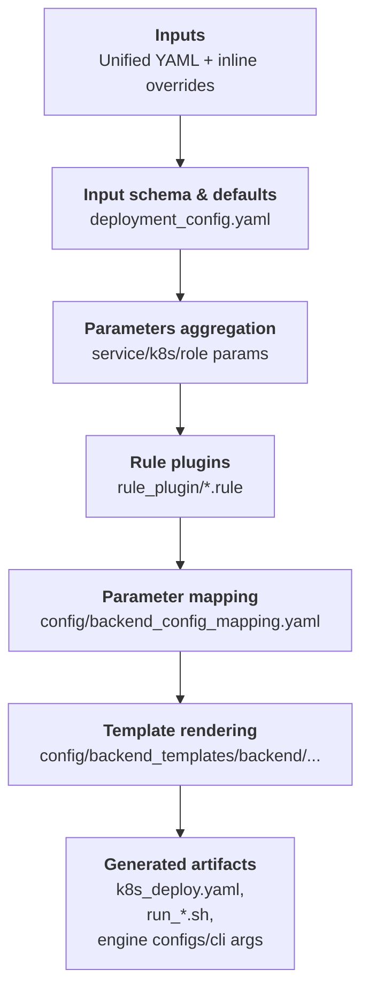

## Generator Overview

This doc explains what the generator emits, the roles of its core pieces, and how to run it to produce backend configs, bash scripts, and kubernetes yaml.

### End-to-End Flow


### Key Components
- Deployment schema (`config/deployment_config.yaml`):  
  ```
  inputs:
    - key: ServiceConfig.port
    - key: ServiceConfig.served_model_name
    - key: K8sConfig.k8s_image
    - key: WorkerConfig.prefill_workers
    - key: SlaConfig.isl
  ```
  Defines the deployment-facing inputs beyond backend flags: service ports and names, per-node GPU counts, K8s image/namespace/engine mode, and SLA knobs like ISL/OSL.

- Backend parameter mapping (`config/backend_config_mapping.yaml`):  
  ```
  - param_key: tensor_parallel_size
    vllm: tensor-parallel-size
    sglang: tensor-parallel-size
    trtllm: tensor_parallel_size
  - param_key: cuda_graph_enable_padding
    sglang:
      key: disable-cuda-graph-padding
      value: "not cuda_graph_enable_padding"
    trtllm:
      key: cuda_graph_config.enable_padding
      value: "cuda_graph_enable_padding"
  ```
  Harmonizes three backends under unified field names and applies simple logic to handle small semantic differences between them.

- Rule plugins (`rule_plugin/*.rule`):  
  ```
  agg_prefill_decode gpus_per_worker = (tensor_parallel_size or 1) * (pipeline_parallel_size or 1) * (data_parallel_size or 1)
  prefill max_batch_size = (max_batch_size if max_batch_size else 1)
  ```
  DSL rules users can extend to influence generated configs. Field names come from `backend_config_mapping.yaml` and `deployment_config.yaml`; prefixes like `agg_`, `prefill_`, and `decode_` scope the impact to that role’s generated outputs.

- Backend templates (`config/backend_templates/<backend>/`):  
  Jinja templates that turn mapped parameters into CLI args, engine configs, run scripts, and Kubernetes manifests (optionally versioned). 

### Using the Generator
You can use the generator in three ways: AIConfigurator CLI, webapp, or standalone (code/CLI).
- AIConfigurator CLI end-to-end:
  ```
  aiconfigurator cli default \
    --backend sglang \
    --backend_version 0.5.6.post2 \
    --model QWEN3_32B \
    --system h200_sxm \
    --total_gpus 8 \
    --isl 5000 --osl 1000 --ttft 2000 --tpot 50 \
    --generator-set ServiceConfig.model_path=Qwen/Qwen3-32B-FP8 \
    --generator-set ServiceConfig.served_model_name=Qwen/Qwen3-32B-FP8 \
    --generator-set K8sConfig.k8s_engine_mode=inline \
    --generator-set K8sConfig.k8s_namespace=ets-dynamo \
    --save_dir ./results
  ```
- Webapp: start with `--enable_profiling` when launching the webapp to surface generator-driven configs.
- Standalone:
  - In code:
    ```python
    from pathlib import Path
    from aiconfigurator.generator.api import (
        generate_backend_artifacts,
        generate_backend_config,
        generate_config_from_input_dict,
    )

    input_params = {
        "SlaConfig": {"isl": 32768, "osl": 1024},
        "ServiceConfig": {
            "model_path": "nvcr.io/nvidia/nemo-llm/llama-2-7b-chat-hf:1.0.0",
            "served_model_name": "llama-2-7b-chat",
            "head_node_ip": "10.0.0.100",
            "port": 8000,
            "include_frontend": True,
        },
        "K8sConfig": {
            "name_prefix": "llama7b",
            "mode": "disagg",
            "enable_router": True,
            "k8s_namespace": "dynamo",
            "k8s_image": "nvcr.io/nvidia/ai-dynamo/tensorrtllm-runtime:0.7.0",
            "k8s_engine_mode": "configmap",
            "k8s_model_cache": "pvc:model-cache-7b",
        },
        "Workers": {
            "prefill": {"tensor_parallel_size": 4, "max_batch_size": 8},
            "decode": {"tensor_parallel_size": 2, "max_batch_size": 16, "max_seq_len": 4096},
        },
        "WorkerConfig": {"prefill_workers": 1, "decode_workers": 2},
    }

    params = generate_config_from_input_dict(input_params, backend="trtllm")
    artifacts = generate_backend_artifacts(params, backend="trtllm", output_dir="./results/sample", backend_version="1.2.0rc3")
    ```
  - Command line: `python -m aiconfigurator.generator.main render-artifacts --backend trtllm --version 1.2.0rc3 --config sample_input.yaml --output ./results`
    ```
    # Sample sample_input.yaml
    
    ServiceConfig:
      model_path: Qwen/Qwen3-32B
      served_model_name: qwen3-32b
      head_node_ip: 0.0.0.0
      port: 8000
    K8sConfig:
      k8s_namespace: dynamo
      k8s_image: nvcr.io/nvidia/ai-dynamo/tensorrtllm-runtime:0.7.1
    WorkerConfig:
      prefill_workers: 1
      decode_workers: 1
    Workers:
      prefill:
        tensor_parallel_size: 2
        pipeline_parallel_size: 1
        data_parallel_size: 1
      decode:
        tensor_parallel_size: 2
        pipeline_parallel_size: 1
        data_parallel_size: 1
    SlaConfig:
      isl: 4000
      osl: 1000
    ```

### Generated Outputs
- [vllm & sglang] CLI argument strings per role (prefill/decode/agg) for debugging or manual runs.
- [trtllm] Engine config files (prefill/decode/agg) when the backend provides `extra_engine_args*.j2`.
- Run scripts (`run_0.sh`, `run_1.sh`, …) that assign workers to nodes and toggle frontend on the first node.
- Kubernetes manifest (`k8s_deploy.yaml`) with images, namespace, volumes, engine args (inline or ConfigMap), and role-specific settings. 

