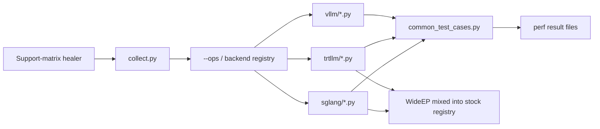
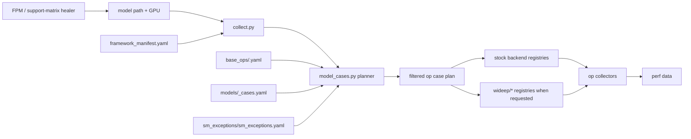
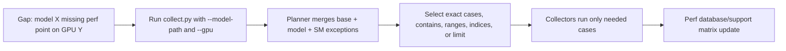

# Collector v2

## Model-centric support-matrix healing

ai-dynamo/aiconfigurator PR #1113

---

# Why This PR Exists

- Support-matrix gaps remain after repeated full collector runs.
- Agents cannot easily heal the matrix because the collector is organized around ops, not models.
- Adding model support requires editing multiple Python files with no single view of what changed.
- Missing perf points are hard to collect as a targeted one-off case.
- WideEP collectors and special runtime images were mixed into stock collector paths.
- DSV4 special-image requirements were implicit.
- Perf outputs still need better compression and organization.

---

# Previous Architecture



Main problem: the collection unit is an op bucket, while the support-matrix gap is usually a model/GPU/framework gap.

---

# Previous Code Shape

```text
collector/
  common_test_cases.py          # model dimensions + shared sweeps in Python
  collect.py                    # op-centric execution
  sglang/
    collect_*.py
    registry.py                 # stock ops + WideEP mixed together
  trtllm/
    collect_*_v1.py
    collect_*_v2.py
    collect_*_v3.py
    registry.py
  vllm/
    collect_*_v1.py
    collect_*_v2.py
    registry.py
```

Model intent, backend behavior, and hardware exclusions were spread across code.

---

# Pain In Practice

- A new model means touching model lists, op generators, backend registries, and sometimes version forks.
- A new GPU means rediscovering unsupported cases by rerunning broad collectors.
- A missing point means running too much, then filtering after the fact.
- Agents spend tokens reconstructing collector intent from Python control flow.
- Special images such as DSV4/WideEP are easy to miss because they are not first-class metadata.

---

# New Design Principle

## Make the model the unit of collection intent

- FPM and support-matrix healing both start from a model.
- Collector v2 resolves a model plus GPU/SM into a planned case set.
- Base op sweeps stay reusable.
- Model-specific dimensions stay in model YAML.
- Hardware/framework exclusions stay in SM exception YAML.
- Python collectors focus on generating and running cases, not owning planning policy.

---

# New Architecture



The planned case set is visible before collection via `--plan-only`.

---

# New Code Shape

```text
collector/
  framework_manifest.yaml
  framework_manifest.py
  collect.py
  model_cases.py
  case_generator.py
  cases/
    base_ops/<op>.yaml
    models/<Architecture>_cases.yaml
    sm_exceptions/sm<version>_exceptions.yaml
  sglang/
  trtllm/
  vllm/
  wideep/
    sglang/
    trtllm/
  network/
```

The centralized YAML layer becomes the reviewable source of collection intent.

---

# Centralized YAML Contract

Base op files own shared sweep policy:

```yaml
all_frameworks_op_cases:
  gemm:
    cases:
      - id: base_transformer_gemm_shape_sweep
```

Model files own model paths, architecture, model dimensions, and extra ops:

```yaml
architecture: DeepseekV4ForCausalLM
model_paths:
  - sgl-project/DeepSeek-V4-Flash-FP8
all_frameworks_op_cases:
  moe:
    cases: all
framework_specific_op_cases:
  sglang:
    wideep_moe:
      cases: all
```

---

# SM-Centric Exceptions

Exceptions are separated from model intent:

```yaml
schema_version: 1
sm_version: 120
gpu_types:
  - rtx_pro_6000_server

framework_specific_op_exceptions:
  sglang:
    moe:
      rules:
        - reason_type: framework_version_unsupported
          version_prefixes: ["0.5.10"]
          match:
            moe_type: nvfp4
```

This lets one GPU/SM file explain what to skip, why, and for which framework version.

---

# Targeted Healing Flow



Collector v2 can collect a whole model, a subset of a model, or an arbitrary case spec.

---

# Collector Behavior

- Op collectors can receive `model_path` directly.
- Legacy collectors still get the same value through `COLLECTOR_MODEL_PATH` while they are migrated.
- Model-specific cases may overlap with base cases.
- Full mode aggregates base cases plus every model case YAML:

```bash
python3 collect.py --backend trtllm --model-cases-full
```

- Healing mode starts narrow:

```bash
python3 collect.py --backend sglang \
  --model-path sgl-project/DeepSeek-V4-Flash-FP8 \
  --gpu b200_sxm
```

---

# WideEP And Images

- WideEP now has its own namespace: `collector/wideep/`.
- Stock SGLang/TRT-LLM registries stay clean.
- WideEP ops are appended only when the model case plan asks for them.
- `framework_manifest.yaml` records framework versions and image metadata.
- DSV4/WideEP special images are documented as runtime metadata instead of implicit tribal knowledge.

```yaml
wideep:
  sglang:
    version: "0.5.10"
    images:
      default: "deepseek-v4-blackwell"
```

---

# How To Add A New Model

1. Create `collector/cases/models/<Architecture>_cases.yaml`.
2. Add `architecture`, `model_path`, and `model_paths`.
3. Set `include_base: true` if the model uses shared base sweeps.
4. Add model dimensions in `model_case_values`.
5. Add `all_frameworks_op_cases` or `framework_specific_op_cases` for model-only ops.
6. Create a new op collector only when no existing op can generate the data point.
7. Validate with `--plan-only` before running collectors.

---

# How To Add A New GPU

1. Add or reuse the system YAML that maps GPU type to SM version.
2. Create `collector/cases/sm_exceptions/sm<version>_exceptions.yaml` when the SM is new.
3. Add `gpu_types` so the exception file documents the concrete hardware.
4. Put skips under `all_frameworks_op_exceptions` or `framework_specific_op_exceptions`.
5. Use `reason_type` to distinguish hardware limits from framework-version gaps.
6. Use `known_exceptions` for failures that happen inside a queued collector subprocess.

---

# What Changes For Agents

- The question becomes "which model, which GPU, which missing case?"
- The answer is inspectable in a small YAML set.
- The healing command is narrow and reproducible.
- The same plan can serve FPM, support-matrix repair, and full framework-version refreshes.
- Less Python archaeology, fewer broad reruns, more intentional perf data.

---

# Follow-Ups

- Compress and organize perf result files by model, GPU, framework, op, and run timestamp.
- Add more examples of arbitrary case specs for one-off debugging.
- Continue migrating collectors to accept `model_path` directly.
- Keep PR review focused on whether YAML intent matches support-matrix needs.
