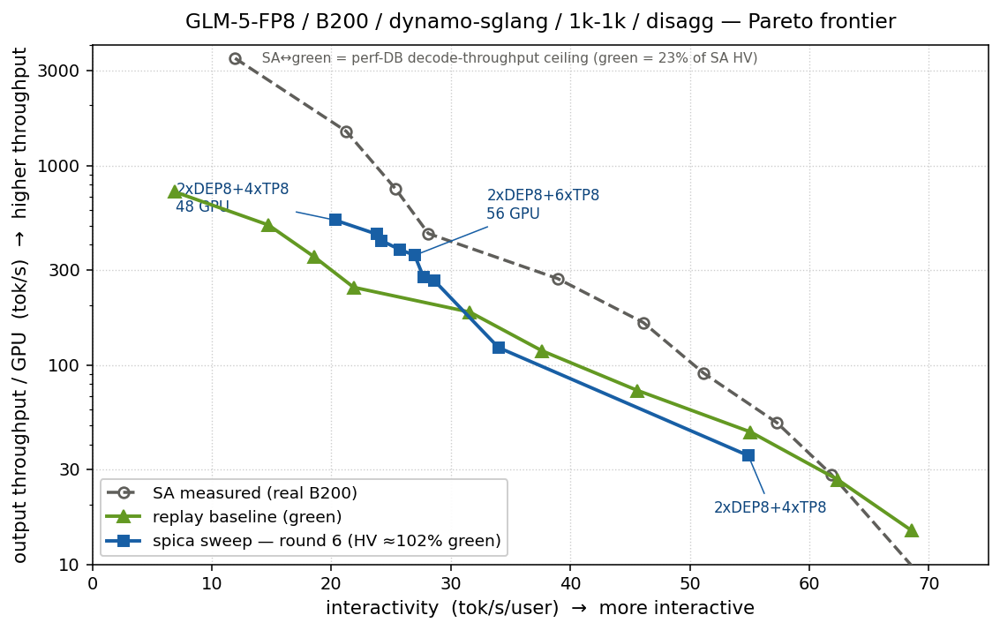

<!--
SPDX-FileCopyrightText: Copyright (c) 2025-2026 NVIDIA CORPORATION & AFFILIATES. All rights reserved.
SPDX-License-Identifier: Apache-2.0
-->

# Experiment — reproducing the SemiAnalysis GLM-5-FP8 disagg frontier (GLM-5-FP8 / B200)

Replay-backed Pareto sweep targeting the InferenceX / SemiAnalysis (SA) **GLM-5-FP8 / B200 /
dynamo-sglang / 1k-1k / disagg** frontier. Two questions: (1) can the mocker reproduce SA's
published interactivity-vs-throughput curve, and (2) can Spica's Pareto sweep **find** it under
the same perf model. The deployment shapes are not pinned — Spica enumerates and searches them.

## Setup

| | |
|---|---|
| model | `zai-org/GLM-5-FP8` (MLA, `kv_lora_rank=512` + `qk_rope=64`, 78 layers; MoE, FP8) |
| hardware | `b200_sxm` |
| backend | dynamo-sglang (wide-EP) |
| deployment | **disagg, static** fixed-fleet (no planner), `gpu_budget=72` (8 prefill + ≤64 decode — SA's largest layout) |
| parallel configs | **not pinned** — Spica enumerates + searches TP / TEP / DEP / DTP shapes (MoE-TP and EP both allowed) |
| workload | synthetic **1k in / 1k out**, closed-loop **concurrency sweep** `[16,32,64,128,256,512,576,800,1248,2576]` (SA's 10 points), `num_request_ratio=3` |
| router | `round_robin` |
| goal | **pareto** — axes = `throughput_per_user` (interactivity, tok/s/user) × `throughput_per_gpu` (output tok/s/GPU), SA's axes |
| dynamo | PR #10964 — the AIC dp-attention KV fix (per-rank → engine-pool ×dp) |

### Two targets: SA-measured vs the green baseline

The right target for a *search* is **not** SA's raw measured numbers but the **green line** = SA's
own per-concurrency configs run through the mocker (the AIC perf model). The green line is the
**achievable ceiling under this perf model**; SA-measured is real B200 hardware.

- `HV(green) ≈ 23% of HV(SA)` over the 10 points. The **SA↔green** gap is the perf-DB
  decode-throughput ceiling (see the last section), not something search can close.
- So "reproduce SA" splits into: *can search reach the green line* (yes — below), and *can the
  perf model reach SA* (no — needs recalibration).

### The DP-attention KV fix (PR #10964)

AIC `estimate_num_gpu_blocks` returns **per-rank** blocks, but the mocker scheduler models **one
KV pool per engine**. For DP-attention each rank holds a full KV replica, so the engine pool must
be `per_rank × dp`. Before the fix, DP-attn shapes were under-provisioned ~`dp`× → high-C floods
(*"KV pool is full, retract"*) and the maxtpt points couldn't run.

With the fix, the stock estimate equals the manual override and **KV is no longer the limiter**.
KV is in fact modeled correctly: `9451 blocks/GPU × 64 = ~295` concurrent 2048-tok seqs/GPU ≈
SA's C=2576-on-8-decode-GPU (`322`, within 9%). MLA is properly accounted (44,928 elem/token, not
the 2.56M of full MHA).

## Baselines — SA-measured vs green (per concurrency)

| C | SA-measured (inter, tput/GPU) | green = AIC-repro (inter, tput/GPU) |
|---:|---|---|
| 16 | 70.2, 7.6 | 68.6, 14.8 |
| 32 | 61.8, 28.3 | 62.4, 26.6 |
| 64 | 57.3, 51.3 | 55.1, 46.1 |
| 128 | 51.2, 90.9 | 45.6, 74.4 |
| 256 | 46.1, 163 | 37.7, 118 |
| 512 | 38.9, 271 | 31.6, 184 |
| 576 | 28.1, 456 | 21.9, 245 |
| 800 | 25.4, 761 | 18.6, 349 |
| 1248 | 21.3, 1483 | 14.8, 503 |
| 2576 | 12.0, 3448 | 6.9, 738 |

`HV(SA) ≈ 64,600`, `HV(green) ≈ 14,990` (**23%**). The two curves track in *shape*; green sits a
constant-ish factor below on throughput, widening at high C (the decode-throughput gap).

SA's decode layout is per-concurrency: **`TP8 ×8`** for C≤512 (TP-attn + MoE-TP), switching to
**`DTP8 ×{4,3,2,1}`** (DP-attn + MoE-TP) for C∈{576,800,1248,2576}; prefill is a fixed 8-GPU unit.

## Sweep config

`run_smart_search`, `goal.target = pareto`. Deployment shapes are searched; concurrency is the
swept Pareto dimension.

```yaml
search_space:
  deployment_mode: [disagg]
  backend: [sglang]
  model_name: zai-org/GLM-5-FP8
  hardware_sku: b200_sxm
  gpu_budget: 72                 # 8 prefill + up to 64 decode GPUs (SA's largest layout)
  context_length: 2048           # = isl+osl; else KV feasibility uses model max and rejects the 8-GPU shapes
  router_mode: [round_robin]
  planner_scaling_policy: [disabled]   # SA points are static deployments
workload:
  isl: 1024
  osl: 1024
  concurrency: [16, 32, 64, 128, 256, 512, 576, 800, 1248, 2576]   # swept Pareto dimension
  num_request_ratio: 3           # num_requests = 3 * concurrency (uniform ramp, matches the AIC curve)
goal:
  target: pareto                 # objectives default = [throughput_per_gpu, throughput_per_user]
sweep:
  max_rounds: 80
  parallel_evals: 8
  max_eval_seconds: 600          # 10-min replay cap per candidate; timeouts -> infeasible
```

## Result — the front reaches/exceeds green by round 6



Targeting green, Spica's Pareto front reaches the green HV at **round 6** (`HV ≈ 102% of green`).
The round-6 frontier (9 non-dominated points):

| interactivity (tok/s/user) | tput/GPU (tok/s) | mapping (prefill + decode) |
|---:|---:|---|
| 20.3 | 532.1 | `2xDEP8 + 4xTP8` |
| 23.8 | 452.1 | `2xDEP8 + 4xTP8` |
| 24.2 | 419.2 | `2xDEP8 + 4xTP8` |
| 25.7 | 379.1 | `2xDEP8 + 4xTP8` |
| 27.0 | 354.5 | `2xDEP8 + 6xTP8` |
| 27.7 | 274.7 | `2xDEP8 + 4xTP8` |
| 28.6 | 265.9 | `2xDEP8 + 6xTP8` |
| 34.0 | 122.1 | `2xDEP8 + 6xTP8` |
| 54.9 | 35.1 | `2xDEP8 + 4xTP8` |

The front converges to a **single 48-GPU deployment** — prefill `2×DEP8` (DP-attn + EP) + decode
`4×TP8` (TP-attn + MoE-TP) — swept over concurrency, peaking at **532 tok/s/GPU** (vs green's 738
tail and SA's 3448). Against SA-measured raw, this is **~23%** (the perf ceiling).

### Exceeds green by area, not pointwise

The front beats green in **hypervolume (area)**, but the HV early-stop fires before the sampler
explores the curve's two corners: the **high-throughput tail** tops out at 532 (< green's 738) and
the **high-interactivity head** reaches only ~55 tok/s/user (< green's 68). The concurrency range
is SA's own `[16..2576]` — it is *not* the limiter; the ends are an HV-vs-pointwise-coverage
artifact. The layout also **differs from SA**: one EP/TP deployment swept over C, vs SA's per-C
`TP8 → DTP8`.

### Why the search can't reach SA-measured (the residual ceiling)

Controlled, env-gated experiments isolate the cause to the **decode-throughput model**, not KV or
search depth:

- **NOT KV** — forcing `num_gpu_blocks=200000` (unlimited) left the ceiling at ~441; KV-independent.
- **NOT search** — scaling decode `speedup_ratio ×8` made round-1 HV jump to **220× SA**; the
  search reaches/exceeds SA in **1 round** once throughput is corrected.
- **IS decode throughput** — the AIC perf-DB batched-decode throughput/GPU **saturates ~450–530**
  while SA's real hardware scales to **3448**. The gap grows with concurrency:
  **1× (low C) → 3.4× (C=1248) → 7.8× (C=2576)** — the AIC throughput-vs-batch curve is too flat.

## Takeaways

- **The mocker reproduces SA's KV / seqs-per-GPU correctly** (~295 vs SA's 322). KV is not the gap;
  the PR #10964 dp fix was the prerequisite for the high-C points to run at all.
- **green = SA's configs under the perf model = 23% of SA's HV** = the perf-DB decode-throughput
  ceiling.
- **Spica's search is not the bottleneck.** It reaches/exceeds the green line by **round 6**
  (`HV ≈ 102%`), and would reach SA in **1 round** if decode throughput were corrected — the SA
  MoE-TP / DP-attn shapes are enumerated, feasible, and on the frontier.
- The found frontier exceeds green by **area**, converging to one **`2xDEP8 + 4xTP8` / 48-GPU**
  deployment swept over C; the two ends stay uncovered and the layout ≠ SA's per-C `TP/DTP`.
- **Reproducing SA's measured curve requires recalibrating the AIC perf-DB's high-batch decode
  throughput — not more sweep rounds and not a wider concurrency range.**
- **Caveat:** the GP optimizer has high run-to-run variance — round 6 is a best-case seed
  (`HV ≈ 102%`); a later run plateaued at ~77% of green. The robust claim is *the green line is
  reachable by search in a handful of rounds*, not a fixed round count.

## Reproduce

```bash
cd aiconfigurator
python -m spica --config docs/spica/examples/<this-config>.yaml  # static disagg, closed-loop concurrency Pareto sweep
```

Notes: the AIC perf model needs the `aic-forward-pass` binding (see README), and **PR #10964**
(the dp-attention KV fix) so DP-attn shapes are KV-provisioned `per_rank × dp`. The **green
baseline** = SA's per-concurrency configs run via `dynamo.replay.run_synthetic_trace_replay`
(static, `planner_config=None`) at `num_request_ratio=3`, `isl=osl=1024`. Axes:
`throughput_per_user` (interactivity) × `throughput_per_gpu`; both higher-is-better, ref `(0,0)`
for hypervolume.
