# AIConfigurator Rust SDK Migration Map

This document maps the Python SDK shape to the target Rust crate shape for the
engine-step latency path. It is intentionally about the core SDK only: CLI,
collectors, generators, webapp, support matrix generation, and Pareto analysis
stay in Python.

## Goal

Move the hot engine-step latency API from:

```text
python frontend -> python sdk -> perf db CSV files
```

to:

```text
python frontend -> Rust SDK through ABI -> perf db CSV files
```

The Rust core should be the source of truth for the AIC core latency model, with
Python retaining orchestration and compatibility wrappers during migration.

## Current State

The existing POC lives in `rust/aiconfigurator-core` and is useful, but it is not
a faithful port of the Python SDK yet.

Known simplifications:

- `src/lib.rs`, `src/model.rs`, and `src/perf.rs` flatten Python's op-graph
  architecture into a small number of aggregate formulas.
- Model-family behavior is partly inferred in `ModelSpec` instead of represented
  as per-family model builders.
- Qwen3-VL configs are currently unwrapped to their text backbone and classified
  as Llama/MoE-like. That matches text-only static behavior, but vision encoder
  ops still need a dedicated Rust slice before multimodal parity can be claimed.
- Gemma 4 and Nemotron-H config parsing handles the same top-level/text-config
  and layer-pattern shapes as Python, but their specialized op graphs are not
  part of the first vLLM MoE smoke slice.
- Perf queries load selected CSVs directly and do not yet mirror every Python
  table owner, fallback, database mode, source tag, or interpolation path.
- The FFI input is ForwardPassMetrics-shaped and useful for the target API, but
  it does not yet preserve enough request shape to reproduce every Python op
  query exactly.

## Target System

```mermaid
flowchart LR
    PY["Python CLI / SDK / webapp"]
    ABI["ctypes ABI wrapper<br/>src/aiconfigurator/sdk/rust_engine_step.py"]
    FFI["Rust C ABI<br/>rust/aiconfigurator-core/src/ffi.rs"]
    API["Rust public API<br/>EngineStepEstimator"]
    MODEL["models<br/>family op graph builders"]
    OPS["operators<br/>queryable op graph nodes"]
    DB["perf_database<br/>CSV loaders + interpolation"]
    DATA["AIC perf DB<br/>src/aiconfigurator/systems/data"]

    PY --> ABI --> FFI --> API
    API --> MODEL --> OPS --> DB --> DATA
```



The Rust crate should expose a stable estimator API. The Python wrapper should
be thin: translate Python config/runtime objects into Rust schema objects,
delegate to Rust, and return AIC-compatible metrics.

## Module Map

The right Rust layout is not a line-by-line translation. Python has useful
separation of concerns; Rust should keep that shape while removing deprecated
or duplicate paths as they are identified.

Migration note: the target Rust paths below mean "Rust equivalent for the core
engine-step path," not "delete the Python file now." Python modules such as
`common.py` and `utils.py` must remain as compatibility surfaces while other
Python-owned CLI, SDK, generator, and analysis code still imports them. During
the transition, the Python/Rust boundary should translate Python objects into
Rust schema values; Python compatibility modules can shrink only after their
Python callers are deprecated or removed.

| SDK area | Python source | Target Rust path | Role in Rust |
| --- | --- | --- | --- |
| Core API | `config.py` | `src/config.rs` | Public `EngineConfig`, `ModelConfig`, `RuntimeConfig`, quant/parallel enums, validation. |
| Core API | `rust_engine_step.py` | `src/ffi.rs` plus Python wrapper | C ABI and schema bridge. Keep Python wrapper minimal until Python SDK deprecation. |
| Core API | `inference_session.py` | `src/session.rs` | Static and engine-step execution semantics once Rust owns the core path. |
| Backends | `backends/base_backend.py` | `src/backends/base.rs` | Shared backend phase logic, memory-independent latency flow, agg-step hooks only when needed by core. |
| Backends | `backends/vllm_backend.py` | `src/backends/vllm.rs` | vLLM-specific defaults and backend quirks. |
| Backends | `backends/sglang_backend.py` | `src/backends/sglang.rs` | SGLang-specific activation and MoE dispatch behavior. |
| Backends | `backends/trtllm_backend.py` | `src/backends/trtllm.rs` | TRT-LLM-specific memory, KV, WideEP, and build-time behavior. |
| Models | `models/base.py` | `src/models/base.rs` | `ModelSpec`, derived metadata, model builder trait, KV-cache sizing. |
| Models | `models/helpers.py` | `src/models/registry.rs` and `src/models/config_loader.rs` | HF config loading, architecture-to-family registry, quant default inference. |
| Models | `models/llama.py` | `src/models/llama.rs` | Dense/GQA model op graph. |
| Models | `models/moe.py` | `src/models/moe.rs` | Traditional MoE and SGLang DeepEP MoE op graphs. |
| Models | `models/deepseek.py` | `src/models/deepseek.rs` | DeepSeek V3 and Kimi K2.5 op graphs, including vLLM attention special-case. |
| Models | `models/deepseek_v32.py` | `src/models/deepseek_v32.rs` | DSA module op graph. |
| Models | `models/deepseek_v4.py` | `src/models/deepseek_v4.rs` | DeepSeek V4 compressed-attention module graph. |
| Models | `models/hybrid_moe.py` | `src/models/hybrid_moe.rs` | Hybrid MoE graph. |
| Models | `models/qwen35.py` | `src/models/qwen35.rs` | Qwen3.5 dense/MoE graph. |
| Models | `models/gemma4_moe.py` | `src/models/gemma4_moe.rs` | Gemma 4 SWA/global attention and dense+MoE FFN graph. Not first latency slice. |
| Models | `models/nemotron_h.py` | `src/models/nemotron_h.rs` | Nemotron-H graph. |
| Models | `models/nemotron_nas.py` | `src/models/nemotron_nas.rs` | Nemotron NAS graph. |
| Models | `models/qwen3vl.py` and `models/vit_ops.py` | `src/models/qwen3vl.rs`, `src/operators/vision.rs` | Vision encoder and multimodal graph. Not first latency slice unless engine-step API needs images. |
| Operations | `operations/base.py` | `src/operators/base.rs` | `Operator` trait, `PerformanceResult`, scaling/source handling. |
| Operations | `operations/gemm.py` | `src/operators/gemm.rs`, `src/perf_database/gemm.rs` | GEMM op plus GEMM/compute-scale/scale-matrix table logic. |
| Operations | `operations/attention.py` | `src/operators/attention.rs`, `src/perf_database/attention.rs` | Context/generation attention ops and table queries. |
| Operations | `operations/mla.py` | `src/operators/mla.rs`, `src/perf_database/mla.rs` | MLA, MLA module, MLA BMM tables. |
| Operations | `operations/dsa.py` | `src/operators/dsa.rs`, `src/perf_database/dsa.rs` | DSA module tables. |
| Operations | `operations/dsv4.py` | `src/operators/deepseek_v4.rs`, `src/perf_database/deepseek_v4.rs` | DeepSeek V4 module tables. |
| Operations | `operations/moe.py` | `src/operators/moe.rs`, `src/perf_database/moe.rs` | MoE compute, dispatch, WideEP, DeepEP. |
| Operations | `operations/communication.py` | `src/operators/communication.rs`, `src/perf_database/communication.rs` | Custom all-reduce, NCCL, P2P, all-to-all. |
| Operations | `operations/elementwise.py` | `src/operators/elementwise.rs` | Memory-bandwidth formula ops. |
| Operations | `operations/embedding.py` | `src/operators/embedding.rs` | Embedding latency/weight accounting. |
| Operations | `operations/overlap.py` | `src/operators/overlap.rs` | Max-of-groups overlap composition. |
| Operations | `operations/mamba.py` | `src/operators/mamba.rs`, `src/perf_database/mamba.rs` | Mamba/GDN tables and ops. |
| Perf database | `perf_database.py` | `src/perf_database/mod.rs` | Database discovery, mode handling, CSV ownership, shared-layer behavior, interpolation helpers. |
| Perf database | `interpolation.py` | `src/interpolation.rs` | 1D/2D/3D interpolation and extrapolation semantics. |
| Shared types | `performance_result.py` | `src/result.rs` | Latency, energy, power/source attribution. |
| Shared types | `system_spec.py` | `src/system_spec.rs` | YAML parsing and typed system hardware spec. |
| Shared types | `common.py` | `src/enums.rs` | Backend, quant, database mode, model family enums. |
| Shared types | `utils.py` | `src/model_config_parser.rs` | HF config parsing, extra params, quant default inference. |
| Out of scope | `task.py`, `picking.py`, `pareto_analysis.py` | Keep Python | Non-goal for this Rust core migration. |

## First Implementation Slice

Start with engine-step latency parity for vLLM 0.19.0 on B200 using the two
smoke models requested:

- `MiniMaxAI/MiniMax-M2.5`
- `moonshotai/Kimi-K2.5`

The current smoke harness covers `static`, `mixed_step`, `agg`, and `disagg`.
Scope for the first real Rust implementation slice:

1. Build Rust op graphs instead of aggregate family formulas.
2. Port GEMM, attention, MoE, dispatch, elementwise, embedding, custom
   all-reduce, P2P, and overlap operators needed by those two models.
3. Port only the database modes needed for parity smoke first. SILICON is the
   priority. HYBRID/EMPIRICAL/SOL should be represented in the schema so they
   are not painted into a corner.
4. Keep `ForwardPassMetrics` as the hot input, but introduce an internal
   normalized `EngineStepWorkload` so Python-static and FPM callers share the
   same Rust execution path.

## Tradeoffs

- A literal Python port is fastest to write but would carry the duplicate
  `PerfDatabase` paths that Python is actively refactoring away. The Rust port
  should keep one table owner per op family.
- A generic op trait is cleaner, but dynamic dispatch in the hot path should be
  avoided once the graph is built. Prefer typed enum dispatch or precompiled op
  vectors unless benchmarks show the trait object overhead is negligible.
- Python's current op graph is behaviorally authoritative. Rust can choose a
  cleaner module layout, but every deletion or deduplication needs parity tests
  that prove the behavior stayed equivalent.
- The current FPM v1 aggregate fields lose per-request distributions. That is
  good for latency overhead and bad for exact parity where variance or sampled
  sequence shape matters. If <1% parity cannot be reached with aggregate FPM,
  the API needs richer request-shape input.

## Current-Iteration Decisions

1. Keep Rust/Python comparison assets under
   `rust/aiconfigurator-core/parity_tests/` and run them explicitly until Python
   SDK deprecation.
2. Use `tp=8, pp=1, attention_dp=1, moe_tp=1, moe_ep=8` as the current smoke
   parallelism because it is valid for both requested MoE models on vLLM 0.19.0.
3. Cover both public Python-visible parity and raw engine-step parity in the
   first slice: `static`, `mixed_step`, `agg`, and `disagg`.
4. Defer source tags and energy accounting until after latency parity.

## Current-Iteration Status

- [x] Migration map exists and covers the target Rust module shape.
- [x] Rust/Python parity smoke tests exist under
  `rust/aiconfigurator-core/parity_tests/` and are allowed to xfail until the
  Rust op graph is complete.
- [x] Benchmark harness reports reproducible case parameters, Python/Rust setup
  cost, hot/cold step latency, and Rust-vs-Python speedup.
- [x] Current-iteration open questions have been resolved into decisions.
- [x] Comprehensive parity scan is documented as a post-implementation phase.

Next implementation checkpoint: once a model/backend slice reaches <1% drift,
flip that case from xfail to a required test.

## Harness Commands

Parity smoke tests (install the Rust core first with `pip install -e ".[rust]"`
or `maturin develop --release`):

```bash
pytest rust/aiconfigurator-core/parity_tests/test_engine_step_parity.py
```

Benchmark harness:

```bash
python rust/aiconfigurator-core/parity_tests/benchmark_engine_step.py --warmup 5 --iterations 50
```

The benchmark prints reproducible case parameters, Python/Rust setup cost,
hot/cold p50/p90/p99 local API-call latency, and Rust-vs-Python speedup.
