# AIConfigurator Rust SDK Migration Map

> **Status (2026-06-01):** the Rust shape described below corresponds
> to the **Phase 1** delivery. Phase 1.5 will invert the model layer
> back into Python and keep only the execution core in Rust — see
> `../phase-1.5-execution-plan.md`. The post-Phase-1.5 module map will
> diverge from this doc; treat this file as the canonical record of
> the Phase 1 endpoint.

This document maps the Python SDK shape to the target Rust crate shape for the
engine-step latency path. It is intentionally about the core SDK only: CLI,
collectors, generators, webapp, support matrix generation, and Pareto analysis
stay in Python.

## Goal

Move the hot engine-step latency API from:

```text
python frontend -> python sdk -> perf db CSV files
```

to:

```text
python frontend -> Rust SDK through ABI -> perf db CSV files
```

The Rust core should be the source of truth for the AIC core latency model, with
Python retaining orchestration and compatibility wrappers during migration.

## Current State

Phase 3 (C1-C10 + C12) and Phase 4 (D1-D8) have landed. The Rust crate
is a faithful apple-to-apple port of Python's engine-step latency path
with full 1↔1 family + op-primitive parity, asserted (no xfails) on
164 surfaces — 41 cases x 4 modes — covering all 14 supported model
families:

- Dense / GQA: Llama (llama.rs), Qwen3 (uses llama.rs), GPT
  (gpt.rs, non-gated FFN).
- MoE: traditional MoE (moe.rs), Hybrid MoE (hybrid_moe.rs,
  Llama-4 / MiMo-V2-Flash 4-bucket), Gemma 4 MoE (gemma4_moe.rs,
  SWA+global with shared MLP + MoE).
- DeepSeek family: standard (deepseek.rs), V3.2 / DSA (deepseek_v32.rs),
  V4 / compressed attention (deepseek_v4.rs), SGLang DeepEP WideEP
  variant (deepseek_wideep.rs), TRT-LLM WideEP variant
  (deepseek_wideep_trtllm.rs); KimiK25 reuses standard DeepSeek.
- Multimodal: Qwen3VL + Qwen3VlMoe (qwen3vl.rs + operators/vision.rs).
- Hybrid state-space: NemotronH (nemotron_h.rs, Mamba2 + attention +
  MLP), Qwen3.5 (qwen35.rs, GDN + full-attention or GDN + MoE).
- NemotronNas (nemotron_nas.rs, per-block heterogeneous config).

`factory.rs` has no `Err` arm; every `ModelFamily` variant routes to a
concrete builder, with the `DeepSeek` family branching on
`WideEpMode::{Off, SglangDeepEp, Trtllm}`.

Smoke coverage spans:

- 3 systems: b200_sxm, h200_sxm, h100_sxm.
- 3 backends: vllm 0.19.0, sglang 0.5.10, trtllm 1.3.0rc10.
- 4 modes per case: static (covers both static_ctx and static_gen
  shapes in one test), mixed_step, agg, disagg.
- Shape variations: decode-heavy, prefill-heavy, prefix-heavy,
  large-batch (in addition to the baseline isl=1024/osl=2 shape).
- Error-symmetry families (Python and Rust both raise on perf-DB
  miss): Llama-4-Scout (HybridMoe), gpt-oss-20b (Gpt),
  DeepSeek-V4-Flash (DeepSeekV4).

Op-graph composition primitives match Python:

- `Op::Overlap` mirrors `OverlapOp` (parallel-stream MoE;
  latency = `max(routed, shared)`).
- `Op::Fallback` mirrors `FallbackOp` (try `MLAModule`; fall back to
  granular `MlaBmm + ContextMla/GenerationMla + MlaBmm`).
- `WideEpContextMlaOp` / `WideEpGenerationMlaOp` mirror Python's
  WideEP MLA pair (the context op applies `prefix_correction` the
  same way the standard MLA op does).
- `WideEpMoeOp` mirrors the TRT-LLM WideEPMoE compute op (10-level
  key with distribution-string fallback and `attention_dp_size`
  scaling).

Module shape today:

- `common/{enums,error,system_spec}` — foundation types and YAML
  system-spec parsing.
- `models/{base,config_loader,registry,factory,llama,moe,deepseek,
  deepseek_v32,deepseek_v4,deepseek_wideep,deepseek_wideep_trtllm,
  gemma4_moe,gpt,hybrid_moe,nemotron_h,nemotron_nas,qwen35,qwen3vl}`
  — family-specific op-graph builders. Each builder populates
  `Model.{context_ops, generation_ops}` exactly the way Python's
  `models/*.py` does. `base::WideEpMode` enum routes the DeepSeek
  WideEP branch.
- `operators/*` — typed `Op` enum with per-variant `query` methods
  that go through `perf_database/*` lookups. Includes
  `wideep_mla` and `wideep_moe` variants alongside the standard
  attention / MLA / MoE / dispatch / comm / elementwise / embedding
  / overlap / fallback set.
- `perf_database/{gemm,attention,mla,moe,wideep_mla,wideep_moe,
  mhc,dsa,dsv4,communication,state_space}` — per-op-owner tables
  with lazy loading (Python Pattern A) and first-wins parity for
  duplicate CSV rows. `dsa.rs` linear-extrapolates on y/z axes
  via `interp_2d_1d_grid_extrapolate_inner` to match Python's
  out-of-grid behavior on sparse `num_heads`.
- `session.rs` — `Phase3Estimator` (`Arc`-wrapped, manual `Debug`
  impl) drives `run_context_phase`, `run_generation_phase`, and
  `get_mix_step_latency_ms`. Mix-step Pass-1 threads
  `combined_prefix` through to ops so MLA `prefix_correction`
  applies even when the MLA module is wrapped in `FallbackOp`.
- `ffi.rs` + `src/aiconfigurator/sdk/rust_engine_step.py` — JSON-shaped
  FFI for the FPM input and a Python ctypes wrapper. The Phase 3
  hot-path entry-point now drives `EngineStepEstimator` directly;
  the legacy aggregate path was removed in the C7 rewire and the
  ~500-line dead-code residue was cleaned out as part of D8.

Known gaps still on the roadmap:

- Performance: smoke benchmark is at 1.1-1.6x p50 speedup vs Python.
  The Phase 3 plan's >=3x target is deferred to Phase 5 (see
  `migration-execution-plan.md`) because closing the gap requires
  cache designs and an FFI fast-path that drift from the Python
  reference shape; landing them inside the parity PR would mix
  concerns.
- Comprehensive matrix scan (originally Phase 4 vision) is gated on
  Phase 5 hot-path work to keep wall-clock reasonable. Re-open as
  Phase 4-bis once Phase 5 lands.
- The FFI input is ForwardPassMetrics-shaped. For AIC's
  homogeneous-batch workload this is lossless (see Tradeoffs); no
  schema enrichment is expected for Phase 3/4 parity. Phase 5 may
  introduce a packed-primitive fast-path entry-point alongside the
  existing JSON entry-point.

## Target System

```mermaid
flowchart LR
    PY["Python CLI / SDK / webapp"]
    ABI["ctypes ABI wrapper<br/>src/aiconfigurator/sdk/rust_engine_step.py"]
    FFI["Rust C ABI<br/>rust/aiconfigurator-core/src/ffi.rs"]
    API["Rust public API<br/>EngineStepEstimator"]
    MODEL["models<br/>family op graph builders"]
    OPS["operators<br/>queryable op graph nodes"]
    DB["perf_database<br/>CSV loaders + interpolation"]
    DATA["AIC perf DB<br/>src/aiconfigurator/systems/data"]

    PY --> ABI --> FFI --> API
    API --> MODEL --> OPS --> DB --> DATA
```



The Rust crate should expose a stable estimator API. The Python wrapper should
be thin: translate Python config/runtime objects into Rust schema objects,
delegate to Rust, and return AIC-compatible metrics.

## Module Map

The right Rust layout is not a line-by-line translation. Python has useful
separation of concerns; Rust should keep that shape while removing deprecated
or duplicate paths as they are identified.

Migration note: the target Rust paths below mean "Rust equivalent for the core
engine-step path," not "delete the Python file now." Python modules such as
`common.py` and `utils.py` must remain as compatibility surfaces while other
Python-owned CLI, SDK, generator, and analysis code still imports them. During
the transition, the Python/Rust boundary should translate Python objects into
Rust schema values; Python compatibility modules can shrink only after their
Python callers are deprecated or removed.

| SDK area | Python source | Target Rust path | Role in Rust |
| --- | --- | --- | --- |
| Core API | `config.py` | `src/config.rs` | Public `EngineConfig`, `ModelConfig`, `RuntimeConfig`, quant/parallel enums, validation. |
| Core API | `rust_engine_step.py` | `src/ffi.rs` plus Python wrapper | C ABI and schema bridge. Keep Python wrapper minimal until Python SDK deprecation. |
| Core API | `inference_session.py` | `src/session.rs` | Static and engine-step execution semantics once Rust owns the core path. |
| Backends | `backends/base_backend.py` | `src/backends/base.rs` | Shared backend phase logic, memory-independent latency flow, agg-step hooks only when needed by core. |
| Backends | `backends/vllm_backend.py` | `src/backends/vllm.rs` | vLLM-specific defaults and backend quirks. |
| Backends | `backends/sglang_backend.py` | `src/backends/sglang.rs` | SGLang-specific activation and MoE dispatch behavior. |
| Backends | `backends/trtllm_backend.py` | `src/backends/trtllm.rs` | TRT-LLM-specific memory, KV, WideEP, and build-time behavior. |
| Models | `models/base.py` | `src/models/base.rs` | `ModelSpec`, derived metadata, model builder trait, KV-cache sizing. |
| Models | `models/helpers.py` | `src/models/registry.rs` and `src/models/config_loader.rs` | HF config loading, architecture-to-family registry, quant default inference. |
| Models | `models/llama.py` | `src/models/llama.rs` | Dense/GQA model op graph. |
| Models | `models/moe.py` | `src/models/moe.rs` | Traditional MoE and SGLang DeepEP MoE op graphs. |
| Models | `models/deepseek.py` | `src/models/deepseek.rs` | DeepSeek V3 and Kimi K2.5 op graphs, including vLLM attention special-case. |
| Models | `models/deepseek_v32.py` | `src/models/deepseek_v32.rs` | DSA module op graph. |
| Models | `models/deepseek_v4.py` | `src/models/deepseek_v4.rs` | DeepSeek V4 compressed-attention module graph. |
| Models | `models/hybrid_moe.py` | `src/models/hybrid_moe.rs` | Hybrid MoE graph. |
| Models | `models/qwen35.py` | `src/models/qwen35.rs` | Qwen3.5 dense/MoE graph. |
| Models | `models/gemma4_moe.py` | `src/models/gemma4_moe.rs` | Gemma 4 SWA/global attention and dense+MoE FFN graph. Not first latency slice. |
| Models | `models/nemotron_h.py` | `src/models/nemotron_h.rs` | Nemotron-H graph. |
| Models | `models/nemotron_nas.py` | `src/models/nemotron_nas.rs` | Nemotron NAS graph. |
| Models | `models/qwen3vl.py` and `models/vit_ops.py` | `src/models/qwen3vl.rs`, `src/operators/vision.rs` | Vision encoder and multimodal graph. Landed in Phase 4 D7 (covers both `Qwen3Vl` and `Qwen3VlMoe`). |
| Models | `models/deepseek_wideep.py` | `src/models/deepseek_wideep.rs` | SGLang DeepEP WideEP DeepSeek variant. Selected via `WideEpMode::SglangDeepEp`. |
| Models | `models/deepseek_wideep_trtllm.py` | `src/models/deepseek_wideep_trtllm.rs` | TRT-LLM WideEP DeepSeek variant with `PDL_FACTOR=0.9`. Selected via `WideEpMode::Trtllm`. |
| Operations | `operations/base.py` | `src/operators/base.rs` | `Operator` trait, `PerformanceResult`, scaling/source handling. |
| Operations | `operations/gemm.py` | `src/operators/gemm.rs`, `src/perf_database/gemm.rs` | GEMM op plus GEMM/compute-scale/scale-matrix table logic. |
| Operations | `operations/attention.py` | `src/operators/attention.rs`, `src/perf_database/attention.rs` | Context/generation attention ops and table queries. |
| Operations | `operations/mla.py` | `src/operators/mla.rs`, `src/perf_database/mla.rs` | MLA, MLA module, MLA BMM tables. |
| Operations | `operations/dsa.py` | `src/operators/dsa.rs`, `src/perf_database/dsa.rs` | DSA module tables. |
| Operations | `operations/dsv4.py` | `src/operators/dsv4.rs`, `src/perf_database/dsv4.rs` | DeepSeek V4 module tables. |
| Operations | `operations/moe.py` (MoE compute + dispatch) | `src/operators/moe.rs`, `src/perf_database/moe.rs` | Standard MoE compute, MoE dispatch (DeepEP normal/low-latency, custom_allreduce). |
| Operations | `operations/moe.py` (TRT-LLM WideEPMoE compute) | `src/operators/wideep_moe.rs`, `src/perf_database/wideep_moe.rs` | WideEPMoE compute op with 10-level key + `attention_dp_size` scaling. |
| Operations | `operations/mla.py` (WideEP MLA) | `src/operators/wideep_mla.rs`, `src/perf_database/wideep_mla.rs` | SGLang WideEP MLA context + generation pair (kernel/fmha/kv/heads/s/b nesting). |
| Operations | `operations/communication.py` | `src/operators/communication.rs`, `src/perf_database/communication.rs` | Custom all-reduce, NCCL, P2P, all-to-all. |
| Operations | `operations/elementwise.py` | `src/operators/elementwise.rs` | Memory-bandwidth formula ops. |
| Operations | `operations/embedding.py` | `src/operators/embedding.rs` | Embedding latency/weight accounting. |
| Operations | `operations/overlap.py` | `src/operators/overlap.rs` | Max-of-groups overlap composition. |
| Operations | `operations/mamba.py` | `src/operators/mamba.rs`, `src/perf_database/mamba.rs` | Mamba/GDN tables and ops. |
| Perf database | `perf_database.py` | `src/perf_database/mod.rs` | Database discovery, mode handling, CSV ownership, shared-layer behavior, interpolation helpers. |
| Perf database | `interpolation.py` | `src/perf_database/interpolation.rs` | 1D/2D/3D interpolation and extrapolation semantics. |
| Shared types | `performance_result.py` | `src/result.rs` | Latency, energy, power/source attribution. |
| Shared types | `system_spec.py` | `src/system_spec.rs` | YAML parsing and typed system hardware spec. |
| Shared types | `common.py` | `src/enums.rs` | Backend, quant, database mode, model family enums. |
| Shared types | `utils.py` | `src/model_config_parser.rs` | HF config parsing, extra params, quant default inference. |
| Out of scope | `task.py`, `picking.py`, `pareto_analysis.py` | Keep Python | Non-goal for this Rust core migration. |

## First Implementation Slice

Engine-step latency parity for vLLM 0.19.0 on B200 using two smoke models:

- `MiniMaxAI/MiniMax-M2.5` (hybrid MoE)
- `moonshotai/Kimi-K2.5` (DeepSeek family, MLA)

Together these cover MoE compute, expert sharding, all-to-all dispatch, MLA
attention, and the dense GEMM path used by both backbones.

Qwen3-VL is intentionally excluded from Phase 3 smoke: it is absent from every
support matrix CSV today and the public `cli_estimate` path errors out on it
(perf-DB interpolation receives `x=0` for vision-encoder-driven queries).
Vision-encoder parity is deferred to Phase 4 once the Python path is fixed
and the support matrix is regenerated.

The current smoke harness covers `static`, `mixed_step`, `agg`, and `disagg`.
Scope for the Phase 3 implementation slice:

1. Build Rust op graphs instead of aggregate family formulas.
2. Port GEMM, attention, MLA, MoE + dispatch, elementwise, embedding, custom
   all-reduce, P2P, and overlap operators needed by those two models.
3. Port only the database modes needed for parity smoke first. SILICON is the
   priority. HYBRID/EMPIRICAL/SOL should be represented in the schema so they
   are not painted into a corner.
4. Keep `ForwardPassMetrics` as the hot input, but introduce an internal
   normalized `EngineStepWorkload` so Python-static and FPM callers share the
   same Rust execution path.

## Tradeoffs

- A literal Python port is fastest to write but would carry the duplicate
  `PerfDatabase` paths that Python is actively refactoring away. The Rust port
  should keep one table owner per op family.
- A generic op trait is cleaner, but dynamic dispatch in the hot path should be
  avoided once the graph is built. Prefer typed enum dispatch or precompiled op
  vectors unless benchmarks show the trait object overhead is negligible.
- Python's current op graph is behaviorally authoritative. Rust can choose a
  cleaner module layout, but every deletion or deduplication needs parity tests
  that prove the behavior stayed equivalent.
- The current FPM v1 aggregate fields collapse per-request distribution into
  sums and counts. For AIC this is lossless: AIC models homogeneous batches,
  Python issues one table query per step with uniform `(batch_size,
  context_length)` shape, and `sum / num_requests` recovers the exact
  per-request value (`mean = max = min`). No FPM schema bump is expected during
  Phase 3 parity work. The schema-richness concern only resurfaces for a
  future Dynamo Mocker integration where a live scheduler produces
  heterogeneous distributions; that is out of Phase 3 scope.

## Current-Iteration Decisions

1. Keep Rust/Python comparison assets under
   `rust/aiconfigurator-core/parity_tests/` and run them explicitly until Python
   SDK deprecation.
2. Use `tp=8, pp=1, attention_dp=1, moe_tp=1, moe_ep=8` as the smoke
   parallelism because it is valid for both MoE smoke models on vLLM 0.19.0.
3. Cover both public Python-visible parity and raw engine-step parity in the
   first slice: `static`, `mixed_step`, `agg`, and `disagg`.
4. Defer source tags and energy accounting until after latency parity.
5. Keep FPM v1 aggregate input. Lossless for AIC's homogeneous-batch workload
   (see Tradeoffs); no schema bump expected during Phase 3.

## Current-Iteration Status

- [x] Migration map exists and covers the target Rust module shape.
- [x] Rust/Python parity smoke tests exist under
  `rust/aiconfigurator-core/parity_tests/`.
- [x] Phase 3 modular implementation has landed (C1-C10 + C12): apple-to-apple
  port of Python's op graph for the smoke slice.
- [x] Benchmark harness reports reproducible case parameters, Python/Rust setup
  cost, hot/cold step latency, and Rust-vs-Python speedup.
- [x] Final Phase 3 benchmark snapshot recorded in `parity_tests/benchmarks.md`.
- [x] Current-iteration open questions have been resolved into decisions.
- [x] Comprehensive parity scan is documented as Phase 4.
- [x] Hot-path optimization (≥3x speedup) is documented as Phase 5.
- [x] Phase 4 expanded the smoke set to 41 cases x 4 modes (164
  surfaces). Each "deferred follow-up" in earlier write-ups turned
  out to be an apple-to-apple translation, not a structural change:
  - D1: `llama.rs` missing `act_gate` + `logits_gemm` ops; force
    `use_qk_norm` for Qwen3 / MiniMax-M2 architectures.
  - D4: `Op::Overlap` for DeepSeek-V3 / R1 shared-expert overlap;
    MLA effective head count = `128 // tp_size`; SGLang dispatch
    default = `CustomAllReduce`.
  - D5: `Op::Fallback` for the SGLang / TRT-LLM MLA fallback chain;
    `MlaBmm` dispatch fix.
  - D6: per-family builders for `Gpt`, `HybridMoe`, `DeepSeekV4`,
    `Gemma4Moe`; DSv3 prefix-heavy fix (mix-step Pass-1
    `combined_prefix` threading); DSv32 sglang DSA linear
    extrapolation.
  - D7: multimodal Qwen3VL + Qwen3VlMoe builders with vision
    encoder ops.
  - D8: WideEP MLA pair, TRT-LLM WideEPMoE compute op, both
    DeepSeek WideEP variant builders (SglangDeepEp + Trtllm); ~500
    dead lines removed from `lib.rs`; `Phase3Estimator` `Arc`-wrapped
    for `ForwardPassPerfModel: Clone`. `factory.rs` now closes all
    14 `ModelFamily` variants — no `Err` arm remains.
- [x] Full 1↔1 Python↔Rust mapping at the model-family + op-primitive
  level. No deferred ports for landed Phase 3/4 scope.

Next implementation checkpoint: Phase 5 (hot-path optimization), or
re-open Phase 4 as a comprehensive matrix scan now that all
landed-family backends share the same op graph.

## Harness Commands

Parity smoke tests:

```bash
AICONFIGURATOR_RUST_CORE_AUTOBUILD=1 pytest rust/aiconfigurator-core/parity_tests/test_engine_step_parity.py
```

Benchmark harness:

```bash
python rust/aiconfigurator-core/parity_tests/benchmark_engine_step.py --warmup 5 --iterations 50
```

The benchmark prints reproducible case parameters, Python/Rust setup cost,
hot/cold p50/p90/p99 local API-call latency, and Rust-vs-Python speedup.
