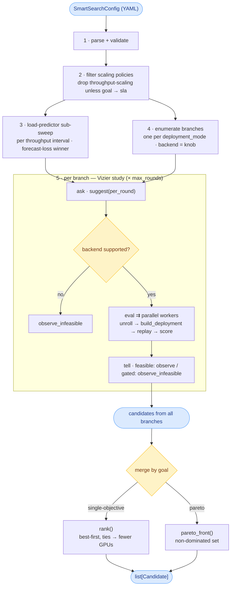

<!--
SPDX-FileCopyrightText: Copyright (c) 2025-2026 NVIDIA CORPORATION & AFFILIATES. All rights reserved.
SPDX-License-Identifier: Apache-2.0
-->

# Spica — overview & sweep flow

Spica turns a deployment-tuning question into a search. You give it four things in one
YAML (`SmartSearchConfig`):

| Block | Model | What it is |
|---|---|---|
| `search_space:` | `SearchSpace` | knobs to **explore** + pinned context (model, hardware, GPU budget) |
| `workload:` | `Workload` | the **traffic** every candidate is replayed against (pinned) |
| `goal:` | `OptimizationGoal` | what **"better"** means (the target metric) + the SLA constraint |
| `sweep:` | `SweepConfig` | run-control (`max_rounds`, `candidates_per_round`, `parallel_evals`, `random_seed`) |

Spica returns the **best deployment config(s)** — a parallel shape + replica count +
backend + engine/router/planner knobs — each scored by a **real dynamo replay** (the
mocker bridge), not an analytical estimate. `run_smart_search` (`src/spica/search.py`)
returns a `list[Candidate]`: best-first for a scalar goal, or the non-dominated set for a
`pareto` goal.

## End-to-end flow

The steps below follow `run_smart_search` (`src/spica/search.py`). Steps **3** (load-predictor
sub-sweep) and **4** (branch enumeration) are independent pre-loop stages — the code happens to
enumerate branches first, but neither depends on the other; we describe the load-predictor sweep
first to keep the planner-scaling story together.

### 1. Parse & validate the config

`SmartSearchConfig.from_yaml` (`src/spica/config.py`) loads the YAML and runs every
pydantic validator: the per-knob choice/dict-key checks (`SearchSpace._validate_search_choices`),
GPU-budget bounds, single-mode-when-pinning-`parallel_configs`, the goal's SLA requirement
(`goodput`/`goodput_per_gpu` need a `ttft_ms`+`itl_ms` or `e2e_ms` SLA), and the rule that a
**list-valued `workload.concurrency` is only allowed under a `pareto` goal**
(`SmartSearchConfig._validate_concurrency_sweep`). An invalid config never reaches the search.

### 2. Filter throughput-scaling policies (`filter_scaling_policies`)

Predictive **throughput scaling** needs an SLA, so it only works when the goal maps to the
planner's `"sla"` target. `goal.target.planner_optimization_target`
(`OptimizationTarget.planner_optimization_target`) maps `goodput`/`goodput_per_gpu` → `"sla"`;
everything else (`throughput`*, `e2e_latency`, `pareto`) → `"throughput"`/`"latency"`.

`filter_scaling_policies` (`src/spica/planner.py`) is called with
`allow_throughput=(planner_optimization_target == "sla")`. When `False`, every
`planner_scaling_policy` entry whose `enable_throughput_scaling` is true (the `throughput_*` /
`hybrid_*` presets, or any dict that sets it) is **dropped up front** — before either the
sampler or the load-predictor sub-sweep sees it. `disabled` / `load_*` survive. The dropped set
is logged. **Error-if-nothing-left:** if dropping leaves `kept` empty (every policy enabled
throughput scaling under a non-`sla` goal), the run raises `ValueError`. The kept list is
written back via `config.model_copy`.

### 3. Load-predictor sub-sweep (`sweep_load_predictor`) — separate from Vizier

`sweep_load_predictor` (`src/spica/load_predictor_sweep.py`) picks the forecaster for
predictive throughput scaling. This is a **standalone brute-force grid**, not part of the
main Vizier loop, and its single winner is injected into every unrolled sample.

- For each **distinct** `throughput_adjustment_interval_seconds` among the (kept) scaling
  policies (`throughput_intervals`), it aggregates the trace into per-interval windows
  (`build_windows`, via the planner's own mooncake tool) and scores **every**
  `load_predictor_candidate` by **mean one-step-ahead forecast loss** (`evaluate_preset` /
  `window_loss` — a weighted log-scale error over num_req·isl, num_req·osl, isl, osl). The
  lowest-loss entry is pinned per interval into `LoadPredictorResult.best_by_interval`. It
  reuses the real dynamo predictor classes, so the chosen preset is what the planner will run.
- **Shortcuts:** no throughput-enabled policy → no intervals → skip entirely
  (`reason="no_throughput_scaling_candidate"`). Static (non-trace) workload → `constant_last`
  for every interval (`reason="static_workload_constant"`) — there is no series to learn. A
  short/empty trace where every preset ties at `inf` loss falls back to `constant_last` for
  that interval.

### 4. Enumerate branches (`enumerate_branches`)

`enumerate_branches` (`src/spica/search_space.py`) builds **one `BranchSpace` per
`deployment_mode`** (agg / disagg) — one Vizier study each, because agg and disagg have
structurally different parallel configs. **`backend` is a searched knob, not a branch**: for
each mode the parallel-config domain is the **union** of every configured backend's
KV-feasible per-worker shapes × replica counts (`parallel_configs_for`), tagged with which
backends support each. A sampled `(backend, parallel_config)` pair the backend can't run is
gated later (step 5). `context_length` is threaded into KV feasibility.

- A backend with no perf DB / no viable config for a mode is dropped from that mode's backend
  knob. A **mode** for which *no* backend is viable is **skipped with a warning** (a viable
  mode still runs); only if *no* mode is viable does it raise `NoViableParallelConfig`.
- A *pinned* `parallel_configs` that is legal for no backend is a **hard error** (fail fast).
- A list-valued `workload.concurrency` (pareto) becomes a per-trial `concurrency` dimension on
  the branch.

### 5. Per-branch Vizier study loop

For each branch, a `BranchSampler` (`make_branch_sampler`, study id
`spica_{mode}_{run_nonce}`) runs `sweep.max_rounds` rounds. Each round is a **barrier**:

1. **ask** — `sampler.suggest(per_round)` returns `per_round` suggestions
   (`candidates_per_round`, defaulting to `parallel_evals`). Runs on the main process.
2. **gate unsupported** — a suggestion whose `(backend, parallel_config)` pair the backend
   can't run is `observe_infeasible`'d immediately and tallied `unsupported` (never evaluated).
3. **evaluate** — the rest fan out across worker processes: a single **spawned**
   `ProcessPoolExecutor` created once for the whole run (amortizing the per-worker dynamo
   import) with `min(parallel_evals, per_round)` workers. The pool is used only when **both**
   `parallel_evals > 1` and `per_round > 1`; otherwise evaluation runs sequentially in-process.
   Each worker runs the pure pipeline `_evaluate_one`: `unroll_sample` → `build_deployment` →
   `ReplayEvaluator.evaluate` (**real replay**) → score (`make_candidate`). Workers never touch
   the Vizier study; a dead pool re-raises a friendly error pointing at the `if __name__ ==
   "__main__":` guard that spawned workers require.
4. **tell** — back on the main process: a **feasible** trial is `observe`'d with its metrics;
   a **gated** trial — over `gpu_budget`, backend-unsupported, or replay-failed — is
   `observe_infeasible`'d (so a high score never steers the sampler into an infeasible region).

`is_feasible` gates on `used_gpus <= gpu_budget` only; SLA is **not** re-gated here (goodput
targets already bake the SLA into the metric). Each trial's outcome is tallied as one of
`feasible` / `infeasible` / `failed` / `unsupported`.

### 6. Merge by the goal

After all branches finish, candidates from every branch are merged (`src/spica/score.py`):

- **single-objective** → `rank()` returns them best-first by signed score, ties broken toward
  fewer GPUs (across branches — backends and modes compete on one list).
- **pareto** → `pareto_front()` returns the non-dominated set over the resolved objectives
  (default `throughput_per_gpu` × `throughput_per_user`), sorted along the last objective (the
  x-axis) so the list traces the frontier left-to-right. (It only considers candidates that
  carry an `objectives` vector; each candidate's `score` still holds the *first* objective's
  value as a headline number, but that is not used for the pareto merge.)

## Flow diagram

Steps 3 (load-predictor sub-sweep) and 4 (branch enumeration) both branch off step 2 — they
are independent and both feed the per-branch loop; qualifiers (error-if-nothing-left,
skip / `constant_last` shortcuts) are described in the prose above.

## See also

- [optimization-goal.md](optimization-goal.md) — the `OptimizationGoal` targets, SLA, scoring,
  and how the goal maps to the planner's `optimization_target`.
- [traffic.md](traffic.md) — the `Workload` load shapes (trace / request-rate / concurrency)
  and the pareto concurrency sweep.
- [search-space.md](search-space.md) — every pinnable/searchable knob, the composite presets,
  and `parallel_configs`.
- [sample.md](sample.md) — how a Vizier suggestion is unrolled into a concrete deployment.
